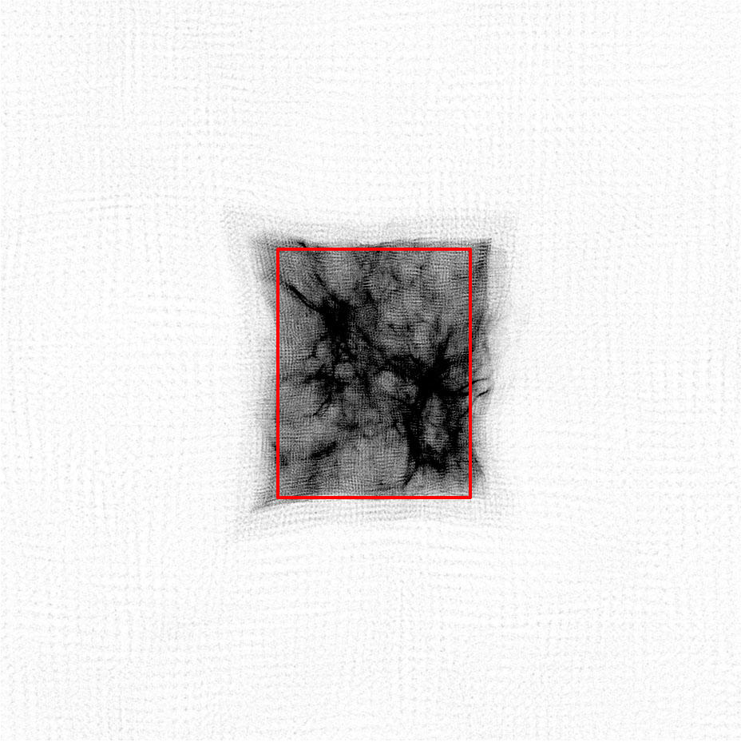

Auto adjusting refine region
============================

Problem
-------

In nested grid simulations, massive particles from outside the finest nested
initial grid can migrate into the refine region. This may cause artifical
collapses in halos whose potential is dominated by one or more massive
particle. To avoid this in the past, the refine region was set to the
Lagrangian volume of the halos of interest at the final redshift.

Solution
--------

On every top-level timestep, we can search for these massive particles inside
the current refine region and adjust the refine region to exclude these
particles. The covering volume of the highest resolution particles may have
been sheared and have an arbitrary shape. We adjust the refine region to have
faces just inside of the innermost, relative to the center of the refine
region, massive particles. Below is an illustration of this new region.

Here is the logic that we have taken to adjust the refine region because it is
not a trivial min/max of the positions of the massive particles. If we were to
take the maximum distance of the highest resolution particles from the refine
region center, we would obtain a minimum covering volume that contains all high
resolution particles, which is not desired. We will incrementally shrink the
region by a cell width on the level with the finest nested initial grid.

#. Find the mass of the highest resolution particle, M\ :sub:`min`.
#. Create a list of any particles with a mass > M\ :sub:`min` inside the current
   refine region. This list is unique on each processor.
#. Because we will incrementally reduce the refine region by cell
   widths, it is convenient to convert the massive particle positions to
   integers in units of these cell widths.
#. Loop while any massive particles are contained in the refine region.
#. Originally the code looped over each face of the refine region to
   search for massive particles, but we found that this favored the
   first faces (x-dimension) in the loop. So we have randomized which
   face we will evaluate.
#. Search for any particles existing in the outermost slab (1 cell
   deep on the whole face) on the region face in question. If any
   massive particles exist in this slab, reduce the refine region by
   one cell width, e.g. -dy on the right face of the y-dimension.
#. Obtain the min/max of the left/right faces of the refine region
   from all processors.
#. Every 6 face loops, check if we have removed any particles
   (communication required).

        If we haven't and there still exists massive particles inside
        the region, there must be particles farther inside (greater than
        a cell width from the refine region boundary), we must reduce
        the refine region on a face to search for these particles. This
        is where the randomization comes into play, so we don't favor
        the x-faces. This could be improved by making an educated guess
        on which face to move inwards by searching for particles near
        the boundary. However, this might be difficult and
        time-consuming.

Below in the attachments (region.mov) is an animation showing the
above process.

.. youtube:: 0LgyJ1HcrQM

