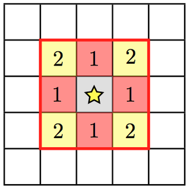
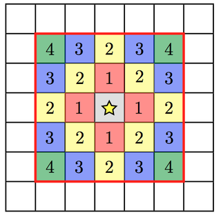

.. _star_particles:

Active Particles: Stars, BH, and Sinks
======================================

There are many different subgrid models of star formation and feedback
in the astrophysical literature, and we have included several of them
in Enzo.  There are also methods that include routines for black hole,
sink, and Pop III stellar tracer formation.  Here we give the details
of each implementation and the parameters that control them.
For relevant parameters please also see :ref:`StarParticleParameters`.

Method 0: Cen & Ostriker
------------------------
Select this method by setting ``StarParticleCreation = 1``.

*Source: star_maker2.F*

This routine uses the algorithm from Cen & Ostriker (1992, ApJL 399,
113) that creates star particles when the following six criteria are
met

#. The gas density is greater than the threshold set in the parameter
   ``StarMakerOverDensityThreshold``.  This parameter is in code units
   (i.e. overdensity with respect to the mean matter density)

#. The divergence is negative

#. The dynamical time is less than the cooling time or the temperature
   is less than 11,000 K.  The minimum dynamical time considered is
   given by the parameter ``StarMakerMinimumDynamicalTime`` in *units
   of years*.

#. The cell is Jeans unstable.

#. The star particle mass is greater than ``StarMakerMinimumMass``,
   which is in units of solar masses.

#. The cell does not have finer refinement underneath it.

These particles add thermal and momentum feedback to the grid cell
that contains it until 12 dynamical times after its creation.  In each
timestep,

.. math::
   
   M_{\rm form} &= M_0 [ (1+x_1) \exp(-x_1) - (1+x_2) \exp(-x_2) ]\\
   x_1 &= (t - t_0) / t_{\rm dyn}\\
   x_2 &= (t + dt - t_0) / t_{\rm dyn}

of stars are formed, where M\ :sub:`0` and t\ :sub:`0` are the initial
star particle mass and creation time, respectively.  

* M\ :sub:`ej` = M\ :sub:`form` * ``StarMassEjectionFraction`` of gas
  are returned to the grid and removed from the particle.

* M\ :sub:`ej` * v\ :sub:`particle` of momentum are added to the cell.

* M\ :sub:`form` * c\ :sup:`2` * ``StarEnergyToThermalFeedback``
  of energy is deposited into the cell.

* M\ :sub:`form` * ((1 - Z\ :sub:`star`) * ``StarMetalYield`` + 
  ``StarMassEjectionFraction`` * Z\ :sub:`star`) of metals are
  added to the cell, where
  Z\ :sub:`star` is the star particle metallicity.  This formulation
  accounts for gas recycling back into the stars.

Method 1: Cen & Ostriker with Stochastic Star Formation
-------------------------------------------------------
Select this method by setting ``StarParticleCreation = 2``.

*Source: star_maker3.F*

This method is suitable for unigrid calculations.  It behaves in the
same manner as Method 1 except

* No Jeans unstable check

* **Stochastic star formation**: Keeps a global sum of "unfulfilled"
  star formation that were not previously formed because the star
  particle masses were under ``StarMakerMinimumMass``.  When this
  running sum exceeds the minimum mass, it forms a star particle.

* Initial star particle velocities are zero instead of the gas
  velocity as in Method 1.

* Support for multiple metal fields.

Method 2: Global Schmidt Law
----------------------------
Select this method by setting ``StarParticleCreation = 4``.

*Source: star_maker4.F*

This method is based on the Kratsov (2003, ApJL 590, 1) paper that
forms star particles that result in a global Schmidt law.  This
generally occurs when the gas consumption time depends on the local
dynamical time.

A star particle is created if a cell has an overdensity greater than
``StarMakerOverDensityThreshold``.  The fraction of gas that is
deposited into the star particle is
dt/``StarMakerMinimumDynamicalTime`` up to a maximum of 90% of the gas
mass.  Here the dynamical time is in *units of years*.

Stellar feedback is accomplished in the same way as Method 1 (Cen &
Ostriker) but M\ :sub:`form` = ``StarMakerEjectionFraction`` * (star
particle mass).

Method 3: Population III Stars
------------------------------
Select this method by setting ``StarParticleCreation = 8``.

*Source: pop3_maker.F*

This method is based on the Abel et al. (2007, ApJL 659, 87) paper
that forms star particles that represents single metal-free stars.
The criteria for star formation are the same as Method 1 (Cen &
Ostriker) with the expection of the Jeans unstable check.  It makes
two additional checks, 

#. The H\ :sub:`2` fraction exceeds the parameter
   ``PopIIIH2CriticalFraction``.  This is necessary because the
   cooling and collapse is dependent on molecular hydrogen and local
   radiative feedback in the Lyman-Werner bands may prevent this
   collapse.

#. If the simulation tracks metal species, the gas metallicity *in an
   absolute fraction* must be below ``PopIIIMetalCriticalFraction``.

Stellar radiative feedback is handled by the :ref:`radiative_transfer`
module.  By default, only hydrogen ionizing radiation is considered.
To include helium ionizing radiation, set ``PopIIIHeliumIonization``
to 1.  Supernova feedback through thermal energy injection is done by
the :ref:`star_particle_class`.  The explosion energy is computed from
the stellar mass and is deposited in a sphere with radius
``PopIIISupernovaRadius`` in *units of pc*.  To track metal
enrichment, turn on the parameter ``PopIIISupernovaUseColour``.

Method 4: Sink particles
------------------------
Select this method by setting ``StarParticleCreation = 16``.

*Source: sink_maker.C*

A couple of variations on this method exist but are not being actively maintained.  
They require a completely different set of parameters to turn on such as BigStarFormation; 
see Grid_StarParticleHandler.C and :ref:`StarParticleParameters`.

*Source: star_maker8.C, star_maker9.C*

Method 5: Radiative Stellar Clusters
------------------------------------
Select this method by setting ``StarParticleCreation = 32``.

*Source: cluster_maker.F*

This method is based on method 1 (Cen & Ostriker) with the Jeans
unstable requirement relaxed.  It is described in Wise & Cen (2009,
ApJ 693, 984).  The star particles created with this method use the
adaptive ray tracing to model stellar radiative feedback.  It
considers both cases of Jeans-resolved and Jeans unresolved
simulations.  The additional criteria are

* The cell must have a minimum temperature of 10,000 K if the
  6-species chemistry model (``MultiSpecies == 1``) is used and 1,000
  K if the 9-species chemistry model is used.

* The metallicity must be above a critical metallicity
  (``PopIIIMetalCriticalFraction``) in absolute fraction.

When the simulation is Jeans resolved, the stellar mass is
instantaneously created and returns its luminosity for 20 Myr.  In the
case when it's Jeans unresolved, the stellar mass follows the Cen &
Ostriker prescription.

Method 6: Reserved for future use
---------------------------------
Reserved for future use.

*Source:*

Method 7: Cen & Ostriker with no delay in formation
---------------------------------------------------
Select this method by setting ``StarParticleCreation = 128``.

*Source: star_maker7.F*

This method relaxes the following criteria from the original Cen &
Ostriker prescription.  See Kim et al. (2011, ApJ 738, 54) for more
details.  It can be used to represent single molecular clouds.

* No Jeans unstable check

* No Stochastic star formation prescription that is implemented in
  Method 1.

* If there is a massive black hole particle in the same cell, the star
  particle will not be created.

The ``StarMakerOverDensity`` is in units of particles/cm\ :sup:`3` and
not in overdensity like the other methods.

Method 8: Springel & Hernquist
------------------------------
Select this method by setting ``StarParticleCreation = 256``.

*Source: star_maker5.F*

This method is based on the Springel & Hernquist method
of star formation described in
`MNRAS, 339, 289, 2003. <http://adsabs.harvard.edu/cgi-bin/nph-data_query?bibcode=2003MNRAS.339..289S&link_type=ABSTRACT>`_
A star may be formed from
a cell of gas if all of the following conditions are met:

#. The cell is the most-refined cell at that point in space.
  
#. The density of the cell is above a threshold.
  
#. The cell of gas is in the region of refinement. For unigrid, or
   AMR-everywhere simulations, this corresponds to the whole volume. But for
   zoom-in simulations, this prevents star particles from forming in areas
   that are not being simulated at high resolution.

If a cell has met these conditions, then these quantities are calculated for
the cell:

* Cell star formation timescale (Eqn 21 from Springel & Hernquist).
     :math:`t_0^{\ast}` and :math:`\rho_{\mathrm{th}}` are inputs to the model,
     and are the star formation time scale and density scaling value,
     respectively. Note that :math:`\rho_{\mathrm{th}}` is not the same as the
     critical density for star formation listed above. :math:`\rho` is the
     gas density of the cell.

     .. math::

       t_{\ast}(\rho)=t_0^{\ast}\left(\frac{\rho}{\rho_{\mathrm{th}}}\right)^{-1/2}
  
* Mass fraction in cold clouds, :math:`x` (see Eqns. 16 and 18).
     :math:`y` is a dimensionless quantity
     calculated as part of the formulation;
     :math:`u_{\textrm{SN}}\equiv(1-\beta)\beta^{-1}\epsilon_{\textrm{SN}}` is
     the energy released from supernovae back into the gas (note that whether
     or not the energy is *actually* returned to the gas depends on if
     ``StarFormationFeedback`` is turned on or not); :math:`\beta` is the
     fraction of stars that go supernova soon after formation;
     :math:`\epsilon_{\textrm{SN}}` is the energy released from a nominal
     supernova and is set to 4e48 ergs; and finally :math:`\Lambda(\rho, T, z)`
     is the cooling rate of the cell of gas.

     .. math::
     
        y\equiv\frac{t_{\ast}\Lambda(\rho,T,z)}{\rho[\beta u_{\mathrm{SN}}-(1-\beta)u_{\mathrm{SN}}]}
        
        x=1+\frac{1}{2y}-\sqrt{\frac{1}{y}+\frac{1}{4y^2}}

Finally, a star particle of mass :math:`m_{\ast}` is created with probability
:math:`p_{\ast}` (see
Eqn. 39). For a cell, the quantity :math:`p_{\ast}` is calculated (below) and
compared to a random number :math:`p` drawn evenly from [0, 1).
If :math:`p_{\ast} > p`, a star is created. :math:`m_{\ast}` is a parameter of
the model and is the minimum and only star mass allowed;
:math:`m` is the mass of gas in the cell;
:math:`\Delta t` is the size of the simulation time step that
is operative for the cell (which changes over AMR levels, of course).

.. math::

   p_{\ast}=\frac{m}{m_{\ast}}\left\{1-\exp\left[-\frac{(1-\beta)x\Delta t}{t_{\ast}}\right]\right\}

If this star formula is used with AMR, some caution is required. Primarily,
the AMR refinement can not be too aggressive. Values of ``OverDensityThreshold``
below 8 are not recommended. This is because if refinement is more aggressive
than 8 (i.e. smaller), the most-refined cells, where star formation should
happen, can have less mass than a root-grid cell, and for a deep AMR hierarchy
the most refined cells can have mass below :math:`m_{\ast}`. Put another way,
with aggressive refinement the densest cells where stars *should* form may be
prevented from forming stars simply because their total mass is too low.
Keeping ``OverDensityThreshold`` at 8 or above ensures that refined cells have
at least a mass similar to a root-grid cell.

Another reason for concern is in AMR, :math:`\Delta t` changes with AMR level.
Adding a level of AMR generally halves the value of :math:`\Delta t`, which
affects the probability of making a star. In a similar way, a small value of
``CourantSafetyFactor`` can also negatively affect the function of this
star formula.

Method 9: Massive Black Holes
-----------------------------
Select this method by setting ``StarParticleCreation = 512``.

This simply insert a MBH particle based on the information given by an external file (MBHInsertLocationFilename).
See Massive Black Hole Particle Formation in :ref:`StarParticleParameters`.

*Source: mbh_maker.C*

Method 10: Population III stellar tracers
-----------------------------------------
Select this method by setting ``StarParticleCreation = 1024``.

*Source: pop3_color_maker.F*

.. _molecular_hydrogen_regulated_star_formation:

Method 11: Molecular Hydrogen Regulated Star Formation
------------------------------------------------------
Select this method by setting ``StarParticleCreation = 2048``.

*Source: star_maker_h2reg.F* 

This SF recipe incorporates ideas from `Krumholz & Tan (2007)
<http://adsabs.harvard.edu/abs/2007ApJ...654..304K>`_ (KT07),
`Krumholz, McKee, & Tumlinson (2009)
<http://adsabs.harvard.edu/abs/2009ApJ...693..216K>`_ (KMT09) and
`McKee & Krumholz (2010)
<http://adsabs.harvard.edu/abs/2010ApJ...709..308M>`_ (MK10). The star
formation rate density is given by:

     .. math::
   
        \frac{d\rho_\star}{dt} = \epsilon_\star \, f_{\rm H_2} \, \frac{\rho}{t_{\rm ff}}.

The SF time scale is the gas free fall time (:math:`t_{\rm ff} \sim
\rho^{-1/2}`), and thus the SFR density is effectively proportional to
:math:`\rho^{3/2}`. :math:`\epsilon_\star` (``H2StarMakerEfficiency``)
is the specific star formation efficiency per free-fall time, which
typically is around 1% (KT07). The SFR is proportional
to the *molecular hydrogen density*, not the total gas density. The H\
:sub:`2` fraction (:math:`f_{\rm H_2}`) is estimated using the
prescription given by KMT09 and MK10, which is based on 1D
radiative transfer calculations and depends on the neutral hydrogen
number density, the metallicity, and the H\ :sub:`2` dissociating
flux. The prescription can be written down in four lines:

     .. math::
   
        \chi &= 71 \left( \frac{\sigma_{d,-21}}{R_{-16.5}} \right) \frac{G_0'}{n_H}; \qquad {\rm [MK10 \; Eq.(9)]} \\
	\tau_c &= 0.067 \, Z' \, \Sigma_H; \qquad {\rm [KMT09 \; Eq.(22)]} \\
        s &= \frac{ \ln( 1 + 0.6 \, \chi + 0.01 \, \chi^2)}{0.6 \tau_c}; \qquad {\rm [MK10 \; Eq.(91)]} \\
	f_{\rm H_2} &\simeq 1 - \frac{0.75 \, s}{1 + 0.25 s} \qquad {\rm [MK10 \; Eq.(93)]}

* :math:`\left( \frac{\sigma_{d,-21}}{R_{-16.5}} \right)` is the ratio of the dust cross section per H nucleus to 1000 Angstroem radiation normalized to 10\ :sup:`-21` cm\ :sup:`2` (:math:`\sigma_{d,-21}`) to the rate coefficient for H\ :sub:`2` formation on dust grains normalized to the Milky Way value of 10\ :sup:`-16.5` cm\ :sup:`3` s\ :sup:`-1` (:math:`R_{-16.5}`). Both are linearly proportional to the dust-to-gas ratio and hence the ratio is likely independent of metallicity. Although its value is probably close to unity in nature (see discussion in KMT09), Krumholz & Gnedin (2011) argue that in simulations with spatial resolution of ~50 pc, the value of :math:`R_{-16.5}` should be increased by a factor of ~30 in order to account for the subgrid clumping of the gas. The value of this ratio can be controlled with the parameter ``H2StarMakerSigmaOverR``.

* :math:`G_0'` is the H\ :sub:`2` dissociating radiation field in units of the typical value in the Milky Way (7.5x10\ :sup:`-4` cm\ :sup:`3` s\ :sup:`-1`, Draine 1978). At the moment only a spatially uniform and time-independent radiation field is supported, and its strength is controlled by the parameter ``H2StarMakerH2DissociationFlux_MW``.

* :math:`Z'` is the gas phase metallicity normalized to the solar neighborhood, which is assumed to be equal to solar metallicity: Z' = Z/0.02.

* :math:`\Sigma_H` is the column density of the gas *on the scale of a giant atomic-molecular cloud complexes*, so ~50-100 pc. This column density is calculated on the MaximumRefinementLevel grid cells, and it implies that **this star formation method can only safely be used in simulations with sub-100pc resolution**. If ``H2StarMakerUseSobolev`` is set, the column density is calculated through a Sobolev-like approximation, :math:`\Sigma \sim \rho \times (\rho / \nabla \rho)`, otherwise it's simply :math:`\Sigma = \rho \times dx`, which introduces an undesirable explicit resolution dependence.

* If ``H2StarMakerAssumeColdWarmPressureBalance == 1``, then the additional assumption of pressure balance between the Cold Neutral Medium (CNM) and the Warm Neutral Medium (WNM) removes the dependence on the H\ :sub:`2` dissociating flux (KMT09). In this case

     .. math::
   
        \chi = 2.3 \left( \frac{\sigma_{d,-21}}{R_{-16.5}} \right) \frac{1 + 3.1 \, Z'^{0.365}}{\phi_{\rm CNM}},  \qquad {\rm [KMT09 \; Eq.(7)]}

where :math:`\phi_{\rm CNM}` is the ratio of the typical CNM density
to the minimum density at which CNM can exist in pressure balance with
WNM. Currently :math:`\phi_{\rm CNM}` is hard-coded to the value of 3.

It is possible to impose an H\ :sub:`2` floor in cold gas, which might
be applicable for some low density situations in which the KMT09
equilibrium assumption may not hold. The parameter
``H2StarMakerH2FloorInColdGas`` can be used to enforce such a floor
for all cells that have temperature less than
``H2StarMakerColdGasTemperature``. This has not been extensively
tested, so caveat emptor.

Optionally, a proper number density threshold
(``H2StarMakerNumberDensityThreshold``) and/or an H\ :sub:`2` fraction
threshold (``H2StarMakerMinimumH2FractionForStarFormation``) is
applied, below which no star formation occurs.

Typically this method is used with
``StarFormationOncePerRootGridTimeStep``, in which case SF occurs only
at the beginning of the root grid step and only for grids on
MaximumRefinementLevel, but with a star particle mass that is
proportial to the root grid time step (as opposed to the much smaller
time step of the maximally refined grid). This results in fewer and
more massive star particles, which improves computational
efficiency. Even so, it may be desirable to enforce a lower limit to
the star particle mass in some cases. This can be done with the
parameter ``H2StarMakerMinimumMass``, below which star particles are
not created. However, with ``H2StarMakerStochastic``, if the
stellar mass is less than H2StarMakerMinimumMass, then a star
particle of mass equal to H2StarMakerMinimumMass is formed
stochastically with a probability of (stellar
mass)/H2StarMakerMinimumMass.

**Important Note**: There is no feedback scheme corresponding to this
star maker, so don't set StarParticleFeedback = 2048. Instead the user
should select one of the feedback schemes associated with the other
star makers (StarParticleFeedback = 4 comes to mind).

Restarting a Simulation With Star Formation or Feedback
-------------------------------------------------------

Sometimes it is convenient to run a simulation for a while until it comes
to some sort of equilibrium before turning on star formation.

If a simulation is initialized with star formation and feedback turned off,
particles in the simulation will not have the necessary particle attribute
fields Enzo uses to track data like the formation time, dynamical time,
and metallicity.

To restart a simulation including star formation or feedback, simply edit
the parameter file written to disk in the data dump folder (i.e. for a dataset
named ``DD0100``, the parameter file will typically be named ``DD0100/DD0100``.
Change the parameters ``StarParticleCreation`` or ``StarParticleFeedback`` to
the values needed for your simulation, and restart the simulation.  Enzo will
detect that it needs to create particle attribute fields and allocate the 
necessary memory above what is needed to read in the dataset.

.. _distributed_feedback:

Distributed Stellar Feedback
----------------------------

The following applies to Methods 0 (Cen & Ostriker) and 1 (+
stochastic star formation).

The stellar feedback can be evenly distributed over the neighboring
cells if ``StarFeedbackDistRadius`` > 0.  The cells are within a cube
with a side ``StarFeedbackDistRadius+1``.  This cube can be cropped to
the cells that are ``StarFeedbackDistCellStep`` cells away from the
center cell, counted only in steps in Cartesian directions.  Below we
show a couple of *two-dimensional* examples. The number on the cells indicates the number cell steps each is from the central cell.

* ``StarFeedbackDistRadius = 1``

Only cells with a step number <= ``StarFeedbackDistCellStep`` have feedback applied to them. So, ``StarFeedbackDistCellStep`` = 1 would result in only the cells marked with a "1" receiving energy. In three-dimensions, the eight corner cells in a 3x3x3 cube would be removed by setting ``StarFeebackDistCellStep`` = 2.

* ``StarFeedbackDistRadius = 2``

Same as the figure above but with a radius of 2.

Feedback regions cannot extend past the host grid boundaries. If the region specified will extend beyond the edge of the grid, it is recentered to lie within the grid's active dimensions. This conserves the energy injected during feedback but results in the feedback sphere no longer being centered on the star particle it originates from. Due to the finite size of each grid, we do not recommend using a ``StarFeedbackDistRadius`` of more than a few cells.

Also see :ref:`StarParticleParameters`.

Notes
------------------------

The routines included in ``star_maker1.F`` are obsolete and not
compiled into the executable.  For a more stable version of the
algorithm, use Method 1.

