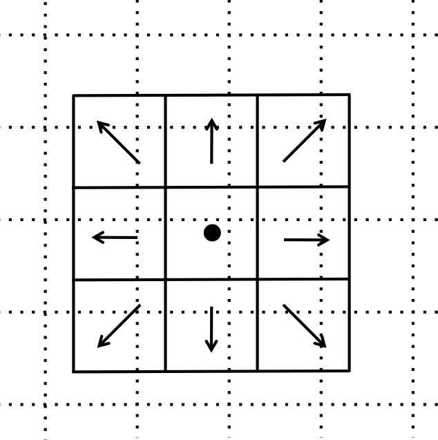
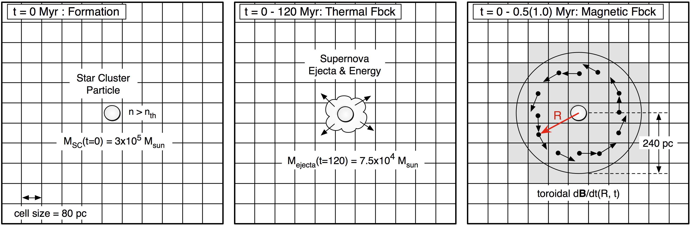

.. _star_particles:

Star, Black Hole and Sink Particles
===================================

There are many different subgrid models of star formation and feedback
in the astrophysical literature, and we have included several of them
in Enzo.  There are also methods that include routines for black hole,
sink, and Pop III stellar tracer formation.  Here we give the details
of each implementation and the parameters that control them.
For relevant parameters please also see
:ref:`StarParticleParameters`.  Note that **this section is
particularly detailed** because users are generally quite interested
in the differences between the methods.  Note also that multiple star
particle creation routines can be used simultaneously with the
``StarParticleCreation`` parameter, as it uses a bitmask - see the
parameter link above for more information.

.. toctree::
   :maxdepth: 2

* `Method 0: Cen & Ostriker`_
* `Method 1: Cen & Ostriker with Stochastic Star Formation`_
* `Method 2: Global Schmidt Law`_
* `Method 3: Population III Stars`_
* `Method 4: Sink Particles`_
* `Method 5: Radiative Stellar Clusters`_
* `Method 6: Kimm & Cen Momentum Feedback`_
* `Method 7: Cen & Ostriker with no delay in formation`_
* `Method 8: Springel & Hernquist`_
* `Method 9: Massive Black Holes`_
* `Method 10: Population III stellar tracers`_
* `Method 11: Molecular Hydrogen Regulated Star Formation`_
* `Method 14: Kinetic Feedback`_
* `Notes`_
* `Restarting a Simulation With Star Formation or Feedback`_
* `Distributed Stellar Feedback`_
* `Tabular Feedback Yields & Source Tracking`_
* `Active Particle Framework`_
* `Magnetic Supernova Feedback`_

.. _method_0:

Method 0: Cen & Ostriker
------------------------
Select this method by setting ``StarParticleCreation = 1``.

*Source: star_maker2.F*

This routine uses the algorithm from `Cen & Ostriker (1992) <http://adsabs.harvard.edu/abs/1992ApJ...399L.113C>`_ 
with additions from `Hopkins et al. (2013) <https://ui.adsabs.harvard.edu/abs/2013MNRAS.432.2647H/abstract>`_ 
that creates star particles when the following six criteria are met

#. The gas density is greater than the threshold set in the parameter
   ``StarMakerOverDensityThreshold``.  This parameter is in code units
   (i.e. overdensity with respect to the mean matter density)

#. The divergence is negative.

#. The dynamical time is less than the cooling time or the temperature
   is less than ``StarMakerTemperatureThreshold``.  The minimum dynamical time considered is
   given by the parameter ``StarMakerMinimumDynamicalTime`` in *units
   of years*.

#. The cell is Jeans unstable.  (**Note:** this may not be useful
   depending on your physical resolution!  Be very careful with this!)

#. The star particle mass is greater than ``StarMakerMinimumMass``,
   which is in units of solar masses.

#. The cell does not have finer refinement underneath it.

#. (Optional) The cell is gravitationally self-bound (Equation 3 
   from `Hopkins et al. (2013) <https://ui.adsabs.harvard.edu/abs/2013MNRAS.432.2647H/abstract>`_)

#. (Optional) The cell has H:sub:`2` mass greater than ``StarMakerMinimumMass``
criteria 4, 7, & 8 are off,
though the results of `Hopkins et al. (2013) <https://ui.adsabs.harvard.edu/abs/2013MNRAS.432.2647H/abstract>`_
strongly suggest enabling the self-bound criterion.

These particles add thermal and momentum feedback to the grid cell
that contains it until 12 dynamical times after its creation.  In each
timestep,

.. math::
   
   M_{\rm form} &= M_0 [ (1+x_1) \exp(-x_1) - (1+x_2) \exp(-x_2) ]\\
   x_1 &= (t - t_0) / t_{\rm dyn}\\
   x_2 &= (t + dt - t_0) / t_{\rm dyn}

of stars are formed, where M\ :sub:`0` and t\ :sub:`0` are the initial
star particle mass and creation time, respectively.  

* M\ :sub:`ej` = M\ :sub:`form` * ``StarMassEjectionFraction`` of gas
  are returned to the grid and removed from the particle.

* M\ :sub:`ej` * v\ :sub:`particle` of momentum are added to the cell.

* M\ :sub:`form` * c\ :sup:`2` * ``StarEnergyToThermalFeedback``
  of energy is deposited into the cell.

* M\ :sub:`form` * ((1 - Z\ :sub:`star`) * ``StarMetalYield`` + 
  ``StarMassEjectionFraction`` * Z\ :sub:`star`) of metals are
  added to the cell, where
  Z\ :sub:`star` is the star particle metallicity.  This formulation
  accounts for gas recycling back into the stars.

.. _method_1:

Method 1: Cen & Ostriker with Stochastic Star Formation
-------------------------------------------------------
Select this method by setting ``StarParticleCreation = 2``.

*Source: star_maker3.F*

This method is suitable for unigrid calculations.  It behaves in the
same manner as Method 1 except

* No Jeans unstable check (**Note:** removing this check may be more
  broadly desirable, depending on your spatial resolution)

* **Stochastic star formation**: Keeps a global sum of "unfulfilled"
  star formation that were not previously formed because the star
  particle masses were under ``StarMakerMinimumMass``.  When this
  running sum exceeds the minimum mass, it forms a star particle.

* Initial star particle velocities are zero instead of the gas
  velocity as in Method 1.

* Support for multiple metal fields.

.. _method_2:

Method 2: Global Schmidt Law
----------------------------
Select this method by setting ``StarParticleCreation = 4``.

*Source: star_maker4.F*

This method is based on the `Kravtsov (2003)
<http://adsabs.harvard.edu/abs/2003ApJ...590L...1K>`_
paper that
forms star particles that result in a global Schmidt law.  This
generally occurs when the gas consumption time depends on the local
dynamical time.

A star particle is created if a cell has an overdensity greater than
``StarMakerOverDensityThreshold``.  The fraction of gas that is
deposited into the star particle is
dt/``StarMakerMinimumDynamicalTime`` up to a maximum of 90% of the gas
mass.  Here the dynamical time is in *units of years*.

Stellar feedback is accomplished in the same way as Method 1 (Cen &
Ostriker) but M\ :sub:`form` = ``StarMakerEjectionFraction`` * (star
particle mass).

.. _method_3:

Method 3: Population III Stars
------------------------------
Select this method by setting ``StarParticleCreation = 8``.

*Source: pop3_maker.F*

This method is based on the `Abel et al. (2007) <http://adsabs.harvard.edu/abs/2007ApJ...659L..87A>`_
paper
that forms star particles that represents single metal-free stars.
The criteria for star formation are the same as Method 1 (Cen &
Ostriker) with the expection of the Jeans unstable check.  It makes
two additional checks, 

#. The H\ :sub:`2` fraction exceeds the parameter
   ``PopIIIH2CriticalFraction``.  This is necessary because the
   cooling and collapse is dependent on molecular hydrogen and local
   radiative feedback in the Lyman-Werner bands may prevent this
   collapse.

#. If the simulation tracks metal species, the gas metallicity *in an
   absolute fraction* must be below ``PopIIIMetalCriticalFraction``.

Stellar radiative feedback is handled by the :ref:`radiative_transfer`
module.  By default, only hydrogen ionizing radiation is considered.
To include helium ionizing radiation, set ``PopIIIHeliumIonization``
to 1.  Supernova feedback through thermal energy injection is done by
the :ref:`star_particle_class`.  The explosion energy is computed from
the stellar mass and is deposited in a sphere with radius
``PopIIISupernovaRadius`` in *units of pc*.  To track metal
enrichment, turn on the parameter ``PopIIISupernovaUseColour``.

.. _method_4:

Method 4: Sink particles
------------------------
Select this method by setting ``StarParticleCreation = 16``.

*Source: sink_maker.C*

Multiple variations on this method exist but are not being actively maintained.  
They require a completely different set of parameters to turn on such as ``BigStarFormation``; 
see Grid_StarParticleHandler.C and :ref:`StarParticleParameters`.

*Source: star_maker8.C, star_maker9.C*

.. _method_5:

Method 5: Radiative Stellar Clusters
------------------------------------
Select this method by setting ``StarParticleCreation = 32``.

*Source: cluster_maker.F*

This method is based on method 1 (Cen & Ostriker) with the Jeans
unstable requirement relaxed.  It is described in `Wise & Cen (2009) <http://adsabs.harvard.edu/abs/2009ApJ...693..984W>`_.
The star particles created with this method use the
adaptive ray tracing to model stellar radiative feedback.  It
considers both cases of Jeans-resolved and Jeans unresolved
simulations.  The additional criteria are

* The cell must have a minimum temperature of 10,000 K if the
  6-species chemistry model (``MultiSpecies == 1``) is used and 1,000
  K if the 9-species chemistry model is used.

* The metallicity must be above a critical metallicity
  (``PopIIIMetalCriticalFraction``) in absolute fraction.

When the simulation is Jeans resolved, the stellar mass is
instantaneously created and returns its luminosity for 20 Myr.  In the
case when it's Jeans unresolved, the stellar mass follows the Cen &
Ostriker prescription.

.. _method_6:

Method 6: Kimm & Cen Momentum Feedback
--------------------------------------
Select this method by setting ``StarParticleFeedback = 64``.

*Source: star_feedback6.F*

This method follows the algorithm described in `Kimm & Cen (2014) <https://ui.adsabs.harvard.edu/abs/2014ApJ...788..121K/abstract>`_ 
and `Kim et al. (2015) <https://ui.adsabs.harvard.edu/abs/2015MNRAS.451.2900K/abstract>`_. 
This method is purely for star particle feedback and can be paired with 
any star particle creation method. Currently, this method only provides 
feedback from Type II and (optionally) Type Ia supernovae. Additional feedback sources 
are a work in progress and will be added later.

At each time step, a certain amount of mass, metals, momentum, and thermal 
energy is deposited into a cube of 27 cells centered on the cell that hosts 
the star particle. There are two options for determining the amounts that 
are deposited:

#. Use the slow feedback method of Cen & Ostriker, which determines the 
   mass of the star particle that has formed in this time step, as in Method 0:

   .. math::
   
      M_{\rm form} &= M_0 [ (1+x_1) \exp(-x_1) - (1+x_2) \exp(-x_2) ]\\
      x_1 &= (t - t_0) / t_{\rm dyn}\\
      x_2 &= (t + dt - t_0) / t_{\rm dyn}

   where M\ :sub:`0` and t\ :sub:`0` are the initial
   star particle mass and creation time, respectively. The deposited mass is 
   M\ :sub:`ej` = M\ :sub:`form` * ``StarMassEjectionFraction``, and this 
   mass is removed from the particle. The deposited metal mass is 
   M\ :sub:`form` * ((1 - Z\ :sub:`star`) * ``StarMetalYield`` + 
   ``StarMassEjectionFraction`` * Z\ :sub:`star`), where
   Z\ :sub:`star` is the star particle metallicity.  This formulation
   accounts for gas recycling back into the stars.

   The ejected momentum and thermal energy are determined through the 
   supernova rate (see below), which is simply calculated as
   N\ :sub:`SN` = M\ :sub:`form`/(100 M\ :sub:`sun`), under the assumption 
   that one Type II supernova occurs for each 100 solar masses of 
   stars formed. This option only accounts for Type II supernovae.

   This is the default option.

#. Use the Tabular Feedback method to determine the Type II and Type Ia 
   supernovae rates, ejected mass, and ejected metals. See :ref:`tabular_sources`. 
   The supernova rates depend on the initial mass, age, and metallicity 
   of the star particle. Select this option with ``StarFeedbackUseTabularYields = 1``.

Once the number of supernovae, ejected mass, and ejected metals for this 
time step have been determined through 
either option, the total injected momentum depends on whether or not the Sedov 
blast wave for the explosion(s) would be resolved, which is determined by 
comparing the ejected mass to the swept-up mass in each cell surrounding 
the star particle. 

The ejected mass per cell is given by dM\ :sub:`ej` = M\ :sub:`ej`/N\ :sub:`cells`, 
where M\ :sub:`ej` is the total ejected mass at this time step and N\ :sub:`cells` 
is the number of cells among which the feedback is distributed. Currently, 
N\ :sub:`cells` = 27 and allowing different values using the parameters 
``StarFeedbackDistRadius`` and ``StarFeebackDistCellStep`` is NOT implemented.

For each cell surrounding the host cell of the star particle, the swept-up 
mass is given by:

.. math::

   {\rm d}M_{\rm swept} = \rho_{\rm cell} (\Delta x_{\rm cell}/2)^3 + 
   \frac{(1-N_{\rm cells})\rho_{\rm host}\Delta x_{\rm host}^3}{N_{\rm cells}} + 
   {\rm d}M_{\rm ej}

where :math:`\rho_{\mathrm{cell}}` and :math:`\rho_{\mathrm{host}}` are 
the densities of the cell of consideration and the host cell, and 
:math:`\Delta x_{\mathrm{cell}}` and :math:`\Delta x_{\mathrm{host}}` are 
the sizes of the cell of consideration and the host cell.

For each cell surrounding the star particle, the ratio of the ejected mass 
per cell to the swept-up mass per cell is :math:`\chi = {\rm d}M_{\rm swept}/{\rm d}M_{\rm ej}` 
and :math:`\chi` is compared to a threshold value given by:

.. math::

   \chi_{\rm thr} = 69.58 N_{\rm SN}^{-2/17} n_{\rm avg}^{-4/17} Z_{\rm avg}^{-0.28}

where n\ :sub:`avg` is the average hydrogen number density of all cells 
surrounding the star particle (including the host cell) and Z\ :sub:`avg` is 
the average metallicity of all cells surrounding the star particle (including 
the host cell), with a minumum of 0.01 solar.

For each cell surrounding the star particle, :math:`\chi` is checked against 
:math:`\chi_{\rm thr}`:

* If :math:`\chi < \chi_{\rm thr}`, the Sedov blast wave explosion is 
  resolved in this cell. The amount of momentum injected into this cell is 

  .. math::

   {\rm d}p = \frac{\sqrt{2\chi M_{\rm ej} f_e N_{\rm SN} (10^{51}\ {\rm ergs})}}{N_{\rm cells}}

  where :math:`f_e = \frac{\chi - 1}{3(\chi_{\rm thr}-1)}` is used to smoothly 
  connect this regime and that where :math:`\chi \ge \chi_{\rm thr}`.

* If :math:`\chi \ge \chi_{\rm thr}`, the Sedov blast wave is unresolved 
  and thus the momentum injected is the expected momentum at the end of 
  the snowplow phase:

  .. math::

   {\rm d}p = \frac{3 \times 10^5\ M_\odot\ \rm{km/s}\ N_{\rm SN}^{16/17} n_{\rm avg}^{-2/17} Z_{\rm avg}^{-0.14}}{N_{\rm cells}}

Because this calculation is done for every cell surrounding the star particle, 
it is not assumed that the supernovae explode in constant-density ISM.

The momentum is added symmetrically outward from the host cell of the star 
particle, in the frame of the particle, in order to account for the movement 
of the particle. If any cell surrounding the particle would receive a momentum 
kick that would change its velocity by 1000 km/s or greater, the amount of 
momentum it receives is limited to that which produces a velocity change 
of 1000 km/s.

If the total amount of momentum injected through this method does not sum 
to 10\ :sup:`51` ergs of kinetic energy per supernova, thermal energy is 
added to the host cell such that the total kinetic + thermal energy is 
10\ :sup:`51` ergs per supernova.

There is an option in this method to approximate the thermalization of gas 
flows colliding with each other when the momentum is injected. 
If the momentum of any of the surrounding cells *decreases* when the feedback 
momentum is injected, due to e.g. momentum deposited in the opposite direction 
as the motion of the gas in the cell, then thermal energy is injected into 
that cell. The amount of thermal energy injected is equal to the difference 
between the change in the cell's momentum and the change in its momentum 
it would have had if it was stationary, converted from momentum to kinetic 
energy. By default this option is off, but it can be turned on with 
``MomentumCancellationToThermal = 1``.

While the amount of momentum to inject in this method is fully determined 
by the supernova rate and ejection mass, there is an option to multiply 
the injection momentum by a value to increase or decrease the amount of 
momentum injected. Use ``MomentumMultiplier`` to set this value. By default, 
``MomentumMultiplier = 1.0``.

There is an option to write to file feedback logs that list, for each time 
step, the following columns:

* Simulation time in Myr
* Particle ID number
* Particle age in Myr
* Current mass of the star particle in M\ :sub:`sun`
* Initial mass of the star particle in M\ :sub:`sun`
* Number of supernovae in this time step
* M\ :sub:`ej` in M\ :sub:`sun`
* The ejected metal mass, M\ :sub:`Z,ej` in M\ :sub:`sun`
* The total momentum injected in M\ :sub:`sun` km/s 
* The thermal energy injected in ergs 

Each processor creates one log file, titled ``feedbacklog_XXXXXXX.txt`` 
where ``XXXXXXX`` is the processor number. Because each file has one new 
row per particle per time step, these files can get very large and it is 
not recommended to use them except for debugging short runs. By default, 
these logs are not created, but can be turned on with ``WriteFeedbackLogFiles = 1``.

.. _method_7:

Method 7: Cen & Ostriker with no delay in formation
---------------------------------------------------
Select this method by setting ``StarParticleCreation = 128``.

*Source: star_maker7.F*

This method relaxes the following criteria from the original Cen &
Ostriker prescription.  See `Kim et al. (2011) <http://adsabs.harvard.edu/abs/2011ApJ...738...54K>`_
for more details.  It can be used to represent single molecular clouds.

* No Jeans unstable check

* No Stochastic star formation prescription that is implemented in
  Method 1.

* If there is a massive black hole particle in the same cell, the star
  particle will not be created.

The ``StarMakerOverDensity`` is in units of particles/cm\ :sup:`3` and
not in overdensity like the other methods.

.. _method_8:

Method 8: Springel & Hernquist
------------------------------
Select this method by setting ``StarParticleCreation = 256``.

*Source: star_maker5.F*

This method is based on the Springel & Hernquist method
of star formation described in
`MNRAS, 339, 289, 2003. <http://adsabs.harvard.edu/cgi-bin/nph-data_query?bibcode=2003MNRAS.339..289S&link_type=ABSTRACT>`_
A star may be formed from
a cell of gas if all of the following conditions are met:

#. The cell is the most-refined cell at that point in space.
  
#. The density of the cell is above a threshold.
  
#. The cell of gas is in the region of refinement. For unigrid, or
   AMR-everywhere simulations, this corresponds to the whole volume. But for
   zoom-in simulations, this prevents star particles from forming in areas
   that are not being simulated at high resolution.

If a cell has met these conditions, then these quantities are calculated for
the cell:

* Cell star formation timescale (Eqn 21 from Springel & Hernquist).
     :math:`t_0^{\ast}` and :math:`\rho_{\mathrm{th}}` are inputs to the model,
     and are the star formation time scale and density scaling value,
     respectively. Note that :math:`\rho_{\mathrm{th}}` is not the same as the
     critical density for star formation listed above. :math:`\rho` is the
     gas density of the cell.

     .. math::

       t_{\ast}(\rho)=t_0^{\ast}\left(\frac{\rho}{\rho_{\mathrm{th}}}\right)^{-1/2}
  
* Mass fraction in cold clouds, :math:`x` (see Eqns. 16 and 18).
     :math:`y` is a dimensionless quantity
     calculated as part of the formulation;
     :math:`u_{\textrm{SN}}\equiv(1-\beta)\beta^{-1}\epsilon_{\textrm{SN}}` is
     the energy released from supernovae back into the gas (note that whether
     or not the energy is *actually* returned to the gas depends on if
     ``StarFormationFeedback`` is turned on or not); :math:`\beta` is the
     fraction of stars that go supernova soon after formation;
     :math:`\epsilon_{\textrm{SN}}` is the energy released from a nominal
     supernova and is set to 4e48 ergs; and finally :math:`\Lambda(\rho, T, z)`
     is the cooling rate of the cell of gas.

     .. math::
     
        y\equiv\frac{t_{\ast}\Lambda(\rho,T,z)}{\rho[\beta u_{\mathrm{SN}}-(1-\beta)u_{\mathrm{SN}}]}
        
        x=1+\frac{1}{2y}-\sqrt{\frac{1}{y}+\frac{1}{4y^2}}

Finally, a star particle of mass :math:`m_{\ast}` is created with probability
:math:`p_{\ast}` (see
Eqn. 39). For a cell, the quantity :math:`p_{\ast}` is calculated (below) and
compared to a random number :math:`p` drawn evenly from [0, 1).
If :math:`p_{\ast} > p`, a star is created. :math:`m_{\ast}` is a parameter of
the model and is the minimum and only star mass allowed;
:math:`m` is the mass of gas in the cell;
:math:`\Delta t` is the size of the simulation time step that
is operative for the cell (which changes over AMR levels, of course).

.. math::

   p_{\ast}=\frac{m}{m_{\ast}}\left\{1-\exp\left[-\frac{(1-\beta)x\Delta t}{t_{\ast}}\right]\right\}

If this star formula is used with AMR, some caution is required. Primarily,
the AMR refinement can not be too aggressive. Values of ``OverDensityThreshold``
below 8 are not recommended. This is because if refinement is more aggressive
than 8 (i.e. smaller), the most-refined cells, where star formation should
happen, can have less mass than a root-grid cell, and for a deep AMR hierarchy
the most refined cells can have mass below :math:`m_{\ast}`. Put another way,
with aggressive refinement the densest cells where stars *should* form may be
prevented from forming stars simply because their total mass is too low.
Keeping ``OverDensityThreshold`` at 8 or above ensures that refined cells have
at least a mass similar to a root-grid cell.

Another reason for concern is in AMR, :math:`\Delta t` changes with AMR level.
Adding a level of AMR generally halves the value of :math:`\Delta t`, which
affects the probability of making a star. In a similar way, a small value of
``CourantSafetyFactor`` can also negatively affect the function of this
star formula.

.. _method_9:

Method 9: Massive Black Holes
-----------------------------
Select this method by setting ``StarParticleCreation = 512``.

This simply insert a MBH particle based on the information given by an external file (MBHInsertLocationFilename).
See Massive Black Hole Particle Formation in :ref:`StarParticleParameters`.

*Source: mbh_maker.C*

.. _method_10:

Method 10: Population III stellar tracers
-----------------------------------------
Select this method by setting ``StarParticleCreation = 1024``.

*Source: pop3_color_maker.F*

.. _molecular_hydrogen_regulated_star_formation:

Method 11: Molecular Hydrogen Regulated Star Formation
------------------------------------------------------
Select this method by setting ``StarParticleCreation = 2048``.

*Source: star_maker_h2reg.F* 

This SF recipe incorporates ideas from `Krumholz & Tan (2007)
<http://adsabs.harvard.edu/abs/2007ApJ...654..304K>`_ (KT07),
`Krumholz, McKee, & Tumlinson (2009)
<http://adsabs.harvard.edu/abs/2009ApJ...693..216K>`_ (KMT09) and
`McKee & Krumholz (2010)
<http://adsabs.harvard.edu/abs/2010ApJ...709..308M>`_ (MK10). The star
formation rate density is given by:

     .. math::
   
        \frac{d\rho_\star}{dt} = \epsilon_\star \, f_{\rm H_2} \, \frac{\rho}{t_{\rm ff}}.

The SF time scale is the gas free fall time (:math:`t_{\rm ff} \sim
\rho^{-1/2}`), and thus the SFR density is effectively proportional to
:math:`\rho^{3/2}`. :math:`\epsilon_\star` (``H2StarMakerEfficiency``)
is the specific star formation efficiency per free-fall time, which
typically is around 1% (KT07). The SFR is proportional
to the *molecular hydrogen density*, not the total gas density. The H\
:sub:`2` fraction (:math:`f_{\rm H_2}`) is estimated using the
prescription given by KMT09 and MK10, which is based on 1D
radiative transfer calculations and depends on the neutral hydrogen
number density, the metallicity, and the H\ :sub:`2` dissociating
flux. The prescription can be written down in four lines:

     .. math::
   
        \chi &= 71 \left( \frac{\sigma_{d,-21}}{R_{-16.5}} \right) \frac{G_0'}{n_H}; \qquad {\rm [MK10 \; Eq.(9)]} \\
	\tau_c &= 0.067 \, Z' \, \Sigma_H; \qquad {\rm [KMT09 \; Eq.(22)]} \\
        s &= \frac{ \ln( 1 + 0.6 \, \chi + 0.01 \, \chi^2)}{0.6 \tau_c}; \qquad {\rm [MK10 \; Eq.(91)]} \\
	f_{\rm H_2} &\simeq 1 - \frac{0.75 \, s}{1 + 0.25 s} \qquad {\rm [MK10 \; Eq.(93)]}

* :math:`\left( \frac{\sigma_{d,-21}}{R_{-16.5}} \right)` is the ratio of the dust cross section per H nucleus to 1000 Angstroem radiation normalized to 10\ :sup:`-21` cm\ :sup:`2` (:math:`\sigma_{d,-21}`) to the rate coefficient for H\ :sub:`2` formation on dust grains normalized to the Milky Way value of 10\ :sup:`-16.5` cm\ :sup:`3` s\ :sup:`-1` (:math:`R_{-16.5}`). Both are linearly proportional to the dust-to-gas ratio and hence the ratio is likely independent of metallicity. Although its value is probably close to unity in nature (see discussion in KMT09), Krumholz & Gnedin (2011) argue that in simulations with spatial resolution of ~50 pc, the value of :math:`R_{-16.5}` should be increased by a factor of ~30 in order to account for the subgrid clumping of the gas. The value of this ratio can be controlled with the parameter ``H2StarMakerSigmaOverR``.

* :math:`G_0'` is the H\ :sub:`2` dissociating radiation field in units of the typical value in the Milky Way (7.5x10\ :sup:`-4` cm\ :sup:`3` s\ :sup:`-1`, Draine 1978). At the moment only a spatially uniform and time-independent radiation field is supported, and its strength is controlled by the parameter ``H2StarMakerH2DissociationFlux_MW``.

* :math:`Z'` is the gas phase metallicity normalized to the solar neighborhood, which is assumed to be equal to solar metallicity: Z' = Z/0.02.

* :math:`\Sigma_H` is the column density of the gas *on the scale of a giant atomic-molecular cloud complexes*, so ~50-100 pc. This column density is calculated on the MaximumRefinementLevel grid cells, and it implies that **this star formation method can only safely be used in simulations with sub-100pc resolution**. If ``H2StarMakerUseSobolev`` is set, the column density is calculated through a Sobolev-like approximation, :math:`\Sigma \sim \rho \times (\rho / \nabla \rho)`, otherwise it's simply :math:`\Sigma = \rho \times dx`, which introduces an undesirable explicit resolution dependence.

* If ``H2StarMakerAssumeColdWarmPressureBalance == 1``, then the additional assumption of pressure balance between the Cold Neutral Medium (CNM) and the Warm Neutral Medium (WNM) removes the dependence on the H\ :sub:`2` dissociating flux (KMT09). In this case

     .. math::
   
        \chi = 2.3 \left( \frac{\sigma_{d,-21}}{R_{-16.5}} \right) \frac{1 + 3.1 \, Z'^{0.365}}{\phi_{\rm CNM}},  \qquad {\rm [KMT09 \; Eq.(7)]}

where :math:`\phi_{\rm CNM}` is the ratio of the typical CNM density
to the minimum density at which CNM can exist in pressure balance with
WNM. Currently :math:`\phi_{\rm CNM}` is hard-coded to the value of 3.

It is possible to impose an H\ :sub:`2` floor in cold gas, which might
be applicable for some low density situations in which the KMT09
equilibrium assumption may not hold. The parameter
``H2StarMakerH2FloorInColdGas`` can be used to enforce such a floor
for all cells that have temperature less than
``H2StarMakerColdGasTemperature``. This has not been extensively
tested, so caveat emptor.

Optionally, a proper number density threshold
(``H2StarMakerNumberDensityThreshold``) and/or an H\ :sub:`2` fraction
threshold (``H2StarMakerMinimumH2FractionForStarFormation``) is
applied, below which no star formation occurs.

Typically this method is used with
``StarFormationOncePerRootGridTimeStep``, in which case SF occurs only
at the beginning of the root grid step and with a star particle mass that is
proportial to the root grid time step (as opposed to the much smaller
time step of the maximally refined grid). Star particles will still only
form on the most refined grid in a given region.
This results in fewer and
more massive star particles, which improves computational
efficiency. Even so, it may be desirable to enforce a lower limit to
the star particle mass in some cases. This can be done with the
parameter ``H2StarMakerMinimumMass``, below which star particles are
not created. However, with ``H2StarMakerStochastic``, if the
stellar mass is less than H2StarMakerMinimumMass, then a star
particle of mass equal to H2StarMakerMinimumMass is formed
stochastically with a probability of (stellar
mass)/H2StarMakerMinimumMass.

For some applications, it may be desireable to create stars only 
at local density peaks. For this purpose, setting 
``H2StarMakerUseLocalDensityMax = 1`` will check if the cell being 
considered for star formation has the highest density of any cell 
in the +/- one cell in the x, y, and z directions. If does not 
have the highest density among these six neighbors, it will not form 
stars. This scheme can only be used if ``H2StarMakerUseSobolev =1``, because 
that routine is needed to calculate the local density gradients.

This star_maker routine can generate a large number of diagnostic 
outputs in text files created at runtime. These files are not 
created by default. 
They can be turned on by setting ``H2StarMakerWriteLogFiles = 1``. 

**Important Note**: There is no feedback scheme corresponding to this
star maker, so do not set StarParticleFeedback = 2048. Instead the user
should select one of the feedback schemes associated with the other
star makers (StarParticleFeedback = 4 comes to mind).

.. _method_14:

Method 14: Kinetic Feedback
-------------------------------------------------------
Select this method by setting ``StarParticleCreation = 16384`` and
``StarParticleFeedback = 16384``.

*Source: star_maker3mom.F*

This method combines stochastic Cen & Ostriker star formation (method 1) with a 
method for injecting both kinetic and thermal feedback energy into the grid.  

The star formation method is identical to method 1, which supplements the star 
formation perscripton of Cen & Ostriker (1992) with a stochastic star formation 
recipe.  Like method 1, there is no Jeans instability check, however, unlike 
method 1, the particle velocity is set to the gas velocity.

This star feedback method is described fully in `Simpson et al. (2015) 
<http://adsabs.harvard.edu/abs/2014arXiv1410.3822S>`_ (S15).  Feedback energy, 
mass and metals are injected into a 3x3x3 CIC stencil cloud that is centered on 
the particle position and mapped onto the physical grid.  The outer 26 cells of 
the cloud stencil impart kinetic energy to the physical grid.  The amount of 
momentum injected into each cell is computed assuming a fixed budget of kinetic 
energy and the direction of the injected momentum is taken to point radially 
away from the star particle.

CIC stencil overlap with the physical grid.  The direction of imparted momentum is indicated with arrows.  [Figure 1 S15]

As with methods 0 and 1, the total amount of feedback energy injected into the 
grid in a given timestep is 

* M\ :sub:`form` * c\ :sup:`2` * ``StarEnergyToThermalFeedback``

This energy is divided between thermal and kinetic energies.  This is despite 
the name of ``StarEnergyToThermalFeedback``, which would indicate that it is 
just thermal energy.  This name was kept for consistency with other star 
makers.

If ``StarMakerExplosionDelayTime`` is negative, M\ :sub:`form` is computed 
as it is for star maker methods 0 and 1 as described above.  If 
``StarMakerExplosionDelayTime >= 0.0`` then M\ :sub:`form` is the initial 
star particle mass.  In this case, all energy, mass and metals are injected 
in a single timestep that is delayed from the formation time of the star 
particle creation by the value of ``StarMakerExplosionDelayTime``, which 
is assumed to be in units of Myrs.  When the feedback is done in a discrete 
explosion, the star particle field called ``dynamical_time`` is instead used 
as a binary flag that indicates wheter the particle has done its feedback 
or not (it is set to 1 pre-explosion and 0 once the explosion has been done).  
When ``StarMakerExplosionDelayTime < 0.0``, ``dynamical_time`` has its 
usual meaning.

The amount of energy that takes kinetic form is fixed to be

* M\ :sub:`form` * c\ :sup:`2` * ``StarEnergyToThermalFeedback`` * f\ :sub:`kin`

If ``StarFeedbackKineticFraction`` is between 0.0 and 1.0, f\ :sub:`kin` = 
``StarFeedbackKineticFraction``.  If ``StarFeedbackKineticFraction < 0.0``, 
then f\ :sub:`kin` is variable and depends on the gas density, metallicity and 
resolution surrounding the star particle at the time of the injection.  
Equations (16), (17) and (18) in S15 describe how this variable fraction 
is computed.

The injection of mass and metals is distributed evenly over the CIC stencil 
cloud and is done in proportion to M\ :sub:`form` as described in method 0.  
The same parameters that control the mass and yield of ejected material are 
the same (i.e. ``StarMassEjectionFraction`` and ``StarMetalYield``). 

The discrete explosion mode and the variable kinetic energy injection mode 
are intended for use with low mass star particles which produce energy 
equivalent to only one or a few supernovae.

Notes
------------------------

The routines included in ``star_maker1.F`` are obsolete and not
compiled into the executable.  For a more stable version of the
algorithm, use Method 1.

.. _restarting:

Restarting a Simulation With Star Formation or Feedback
-------------------------------------------------------

Sometimes it is convenient to run a simulation for a while until it comes
to some sort of equilibrium before turning on star formation.

If a simulation is initialized with star formation and feedback turned off,
particles in the simulation will not have the necessary particle attribute
fields Enzo uses to track data like the formation time, dynamical time,
and metallicity.

To restart a simulation including star formation or feedback, simply edit
the parameter file written to disk in the data dump folder (i.e. for a dataset
named ``DD0100``, the parameter file will typically be named ``DD0100/DD0100``.
Change the parameters ``StarParticleCreation`` or ``StarParticleFeedback`` to
the values needed for your simulation, and restart the simulation.  Enzo will
detect that it needs to create particle attribute fields and allocate the 
necessary memory above what is needed to read in the dataset.

.. _distributed_feedback:

Distributed Stellar Feedback
----------------------------

The following applies to Methods 0 (Cen & Ostriker) and 1 (+
stochastic star formation).

The stellar feedback can be evenly distributed over the neighboring
cells if ``StarFeedbackDistRadius`` > 0.  The cells are within a cube
with a side ``StarFeedbackDistRadius+1``.  This cube can be cropped to
the cells that are ``StarFeedbackDistCellStep`` cells away from the
center cell, counted only in steps in Cartesian directions.  Below we
show a couple of *two-dimensional* examples. The number on the cells indicates the number cell steps each is from the central cell.

* ``StarFeedbackDistRadius = 1``

.. figure:: dist-feedback1.png
   :align: center
   :scale: 70%
   :alt: Distributed feedback with radius 1

Only cells with a step number <= ``StarFeedbackDistCellStep`` have feedback applied to them. So, ``StarFeedbackDistCellStep`` = 1 would result in only the cells marked with a "1" receiving energy. In three-dimensions, the eight corner cells in a 3x3x3 cube would be removed by setting ``StarFeebackDistCellStep`` = 2.

* ``StarFeedbackDistRadius = 2``

.. figure:: dist-feedback2.png
   :align: center
   :scale: 70%
   :alt: Distributed feedback with radius 2

Same as the figure above but with a radius of 2.

Feedback regions cannot extend past the host grid boundaries. If the region specified will extend beyond the edge of the grid, it is recentered to lie within the grid's active dimensions. This conserves the energy injected during feedback but results in the feedback sphere no longer being centered on the star particle it originates from. Due to the finite size of each grid, we do not recommend using a ``StarFeedbackDistRadius`` of more than a few cells.

Also see :ref:`StarParticleParameters`.

.. _tabular_sources:

Tabular Feedback Yields & Source Tracking
-----------------------------------------

By default, all stellar feedback routines use analytic prescriptions
for mass, metal, and energy yields. 
Tabulated yields computed from stellar population synthesis models such as the
`SYGMA <https://nugrid.github.io/NuPyCEE/overview.html>`_
chemical evolution code can be used instead. These tables
offer a number of benefits including

* easily associating feedback with a particular IMF
* testing multiple nucleosynthetic yields in a galactic or cosmological context
* separating yields from multiple sources, such a different types of supernova (aka source tracking)
* providing yields for pre-supernova feedback such as stellar winds

Tabulated Feedback
++++++++++++++++++

To use tabulated feedback, use the following parameters:

1. Set ``StarMakerStoreInitialMass = 1``
2. Set ``StarFeedbackUseTabularYields = 1``
3. Use ``StarFeedbackTabularFilename`` to specify the path to your HDF5 feedback table.
4. Optionally set ``StarFeedbackTabularSNIIEnergy`` and ``StarFeedbackTabularSNIaEnergy`` 
   if you want these supernovae to have different energies than the canonical 1e51 erg.

Tabulated feedback yields can currently be used by the following
feedback methods:

* :ref:`method_0` (Type II and Ia SNe only)
* :ref:`method_1` (Type II and Ia SNe only)

Source Tracking
+++++++++++++++

To use source tracking, set the following parameters:

1. Enable tabulated feedback following the steps outlined above
2. Set ``StarFeedbackTrackMetalSources = 1``

**NOTE:** ``StarMakerTypeIaSNe`` and ``StarFeedbackTrackMetalSources``
are mutually exclusive.

The following problem types are currently set up to track 
metals from specific feedback sources when using tabulated feedback:

* Cosmology Simulation
* Galaxy Simulation
* Nested Cosmology
* Test Star Particle

Enabling source tracking will add four metallicity color fields to
your outputs:

* ``MetalSNIa_Density`` for Type Ia SNe (this field is also used by the ``StarMakerTypeIaSNe`` parameter)
* ``MetalSNII_Density`` for Type II SNe and swept up stellar winds from massive stars
* ``MetalAGB_Density`` for AGB stellar winds
* ``MetalNSM_Density`` for material from neutron star mergers

To read these additional fields into `yt <https://yt-project.org/>`_ you'll need a 
`modified version of yt <https://github.com/clairekope/yt/tree/enzo_frontend_addition>`_.

Generating Feedback Tables
++++++++++++++++++++++++++

The script for generating feedback yield tables is provided as a 
git submodule inside the ``input/stellar_feedback_for_hydro`` directory.
If you've cloned the Enzo source code from GitHub, 
you can run ``git submodule update --init --recursive`` to activate this submodule
and its components recursively.

Once the ``input/stellar_feedback_for_hydro`` directory has been populated by 
activating the submodule, you can generate a feedback table using the
``chemical_feedback.py`` script. You will need NumPy and h5py to be installed
in your Python environment. The resulting table will be saved as
``input/stellar_feedback_for_hydro/output_tables/sygma_feedback_table.h5``.

SYGMA parameters such as the IMF, nucleosynthetic yield tables, Type II SNe mass range,
and Type Ia SNe delay time distribution can be set by modifying the ``params`` dictionary
at the top of ``chemical_feedback.py``. Additional parameters supported by SYGMA can also
be added to this dictionary; see the `SYGMA documentation <https://nugrid.github.io/NuPyCEE/SPHINX/build/html/sygma.html>`_.

.. _active_particles_dk:

Active Particle Framework
-------------------------

To be added.

.. _magnetic_feedback:

Magnetic Supernova Feedback
----------------------------
*Source: hydro_rk/SuperNovaSeedField.C*

Select this method by setting ``UseMagneticSupernovaFeedback = 1``
(Default = 0) and specifying the parameters below. If
``UseMagneticSupernovaFeedback == 2``, the parameters 
``MagneticSupernovaRadius`` and ``MagneticSupernovaDuration`` will 
be calculated to be the minimum allowed values (see below)
at runtime based on the cell width and time step of the most-refined grid. 

``MagneticSupernovaEnergy`` (in units of ergs) is the total amount
of magnetic energy to be injected by a single supernova event. Defualt = 1e51
ergs.

``MagneticSupernovaRadius`` (in units of parsecs) gives the scale over
which to inject supernova energy. The injection mechanism normalizes the
spatial exponential decay of the injected supernova energy so that all of the
energy is contained within the specified radius. For this reason, the
``MagneticSupernovaRadius`` should be at least 1.5 times the minimum cell width of
the simulation (in pc). Default = 300 pc.

``MagneticSupernovaDuration`` (in units of years) gives the duration of the
supernova magnetic energy injection. The injection mechanism is normalized so
that all of the ``MagneticSupernovaEnergy`` is injected over this
time scale. In order to inject the correct amount of energy, ``MagneticSupernovaDuration`` should be set to at least 5
times the minimum time step of the simulation.  Default = 50,000 years.

The following applies to all star formation methods that produce a
PARTICLE_TYPE_STAR object.  Methods 0 (Cen & Ostriker) and 1 (+
stochastic star formation) have been tested extensively. 
The magnetic feedback method is described fully in `Butsky et al. (2017)
<http://adsabs.harvard.edu/abs/2017ApJ...843..113B>`_.

When a star cluster particle reaches the end of its lifetime, we inject a
toroidal loop of magnetic field at its position in *hydro_rk/Grid_MHDSourceTerms*. The spatial and temporal
evolution of the injected magnetic energy and magnetic field is chosen to be: 

 .. math::

  \dot{U}_{B,\, {source}} = \tau^{-1} \frac{B_0^2}{4\pi} \frac{R}{L}
  e^{-r^2/L^2} e^{-t/\tau} (1-e^{-t/\tau})\\
  \mathbf{\dot{B}}_{source} = \tau^{-1} B_0 \left(\frac{R}{L}\right)^{1/2}
  e^{- r^2 / 2L^2} e^{-t / \tau} \, \hat{\mathbf{e}}_\phi 

where t is the time since the 'death' of the star cluster particle,
:math:`\tau` is the ``SupernovaSeedFieldDuration``, R is the cylindrical
radius, r is the spherical radius, and L is the ``SupernovaSeedFieldRadius``. 

Two-dimensional schematic overview of the life cycle of a star
cluster particle and two channels of its feedback. Left: Star cluster
particle formation. Middle: Thermal feedback. Thermal energy by Type II
supernova explosion is injected into the gas cell in which a star cluster
particle of age less than 120 Myr resides. Right: Magnetic
feedback. Toroidal magnetic fields are seeded within three finest cells
from a star cluster particle. 

