.. HalosInYt:

Halos and Halo Finding in yt
============================

Below are the slides of a talk given by Stephen Skory at the 
2010 Enzo Users Conference held June 28-30 at the San Diego
Supercomputer Center. This talk introduces the three different
methods of finding halos available in yt, and some of the
other tools in yt that can analyze and visualize halos.

The Slides
----------

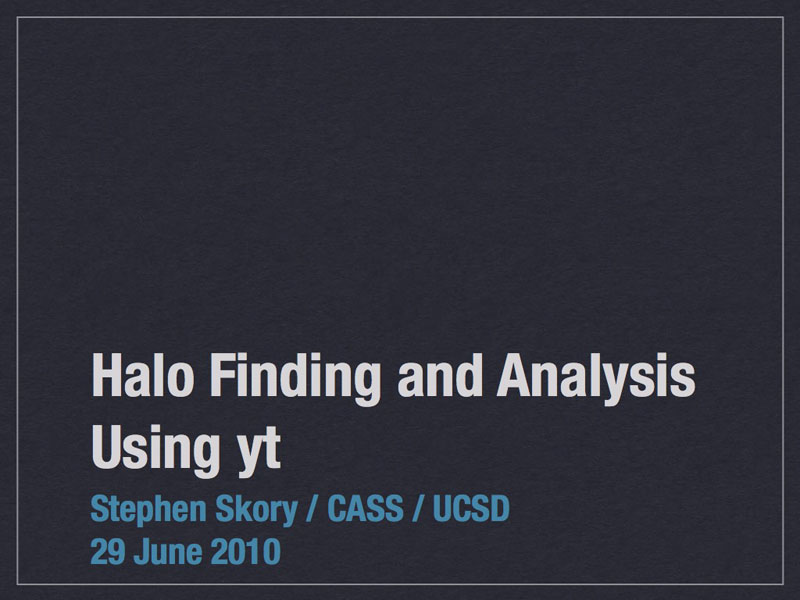

.. image:: _images/skory-002-001.jpg
   :width: 800
   :height: 600

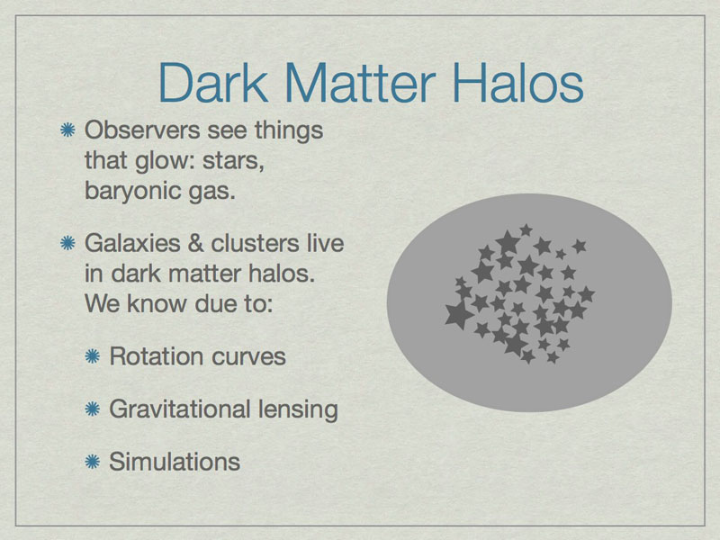

How do we know dark matter exists and surrounds galaxies? Here are some
of the ways.

.. image:: _images/skory-004-001.jpg
   :width: 800
   :height: 600

Observations look for things that glow, like stars, which live in galaxies.
In simulations we want to find where the galaxies are, because that’s where
the interesting things are. It is better to look for dark matter rather than
stars or gas because it is a stronger signal. Also, some simulations don’t
have stars or gas at all, like semi-analytic simulations.

.. image:: _images/skory-005-001.jpg
   :width: 800
   :height: 600

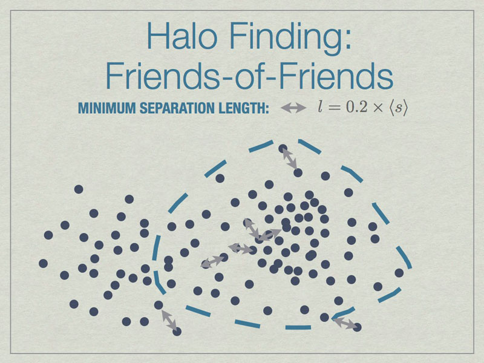

All particles closer than 0.2 of the mean inter-particle separation (s) are
linked, and any all all links of particles are followed recursively to form the
halo groups.

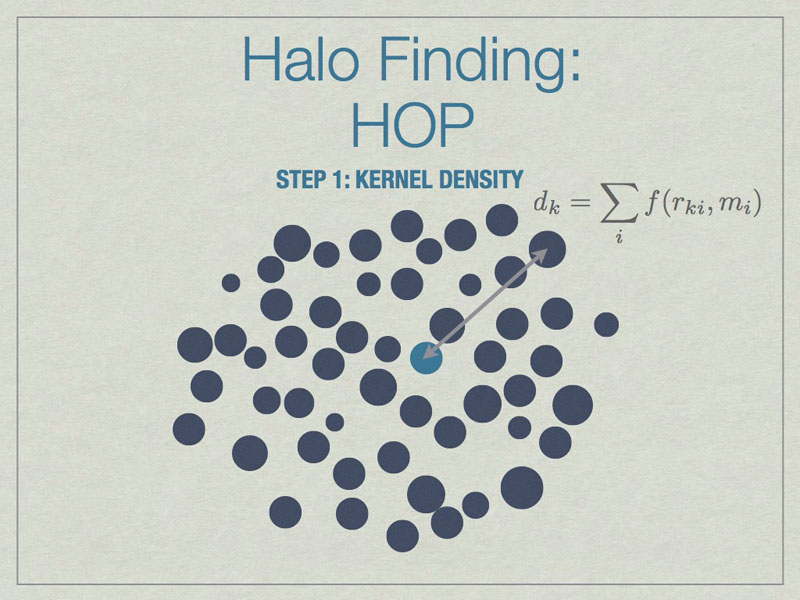

HOP starts by calculating a kernel density for each particle based on the mass of and 
distances to its nearest neighbors, the default is 64 of them.

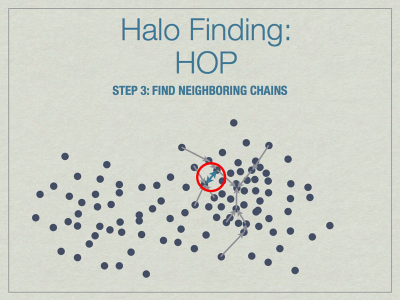

Chains are built by linking particles uphill, from a particle with lower density to one that is 
higher, from the set of nearest neighbors. Particles that are their own densest nearest 
neighbors terminate the chains. Neighborinnearest neighbors, but in different chains.

.. image:: _images/skory-009-001.jpg
   :width: 800
   :height: 600

Neighboring chains are merged to build the final halos using various rules. The figure above 
shows the final halo enclosed by a dashed line. A few particles have been excluded from the 
final halo because they are underdense.

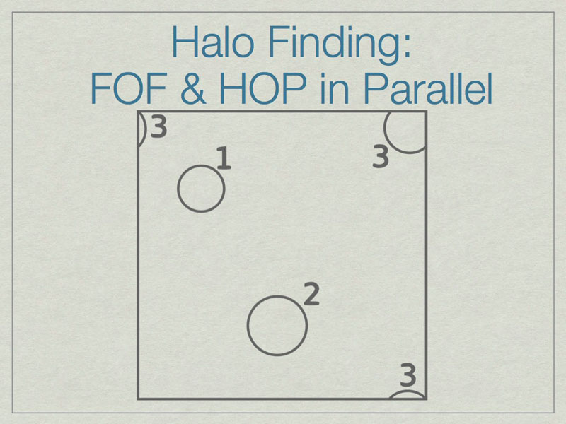

It is possible to run FOF & HOP in parallel. We start here with three halos in a volume, one of 
which (3) lies on the periodic boundary of the volume.

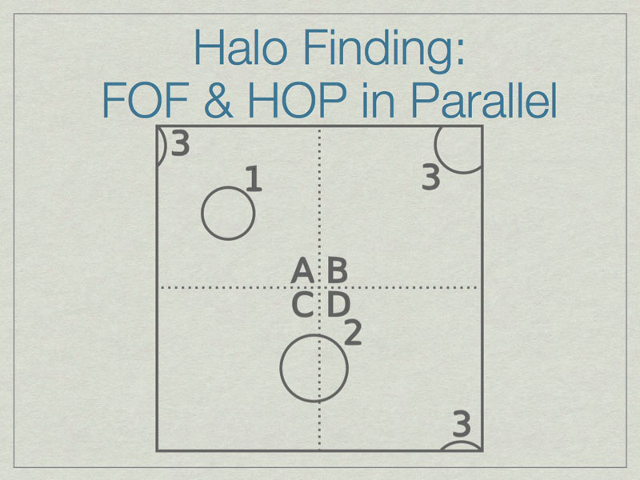

The dashed lines depict the subdivision of the full volume into subvolumes (A,B,C, and D) 
which define the sub-units for parallel analysis. Note that halos 2 & 3 lie in more than one 
subvolume.

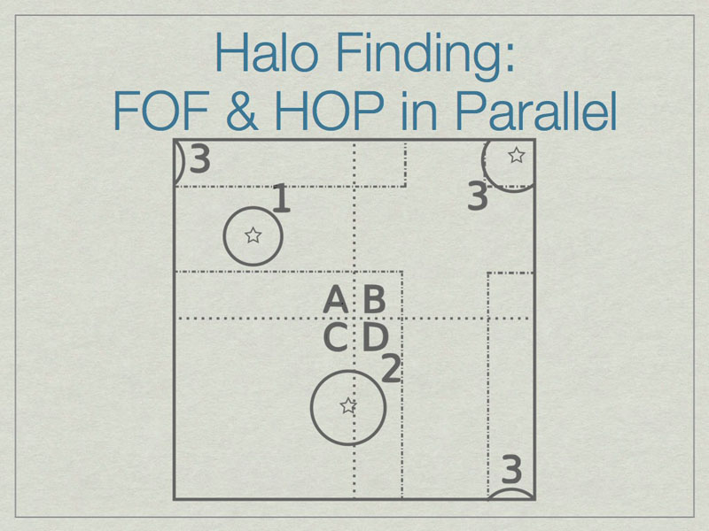

The solution is to add extra data on the faces of the subvolumes such that all halos are fully 
enclosed on at least one subvolume. Here subvolume C has been ‘padded’ which allows halo 
2 to be fully contained in subvolume C. The centers of the halos, shown with stars, determine 
final ownership of halos so there is no duplication. However, this method breaks down when 
the halo sizes are a significant fraction of the full volume.

.. image:: _images/skory-013-001.jpg
   :width: 800
   :height: 600

Parallel HOP is a fully-parallel implementation of HOP that allows both computation and 
memory load to be distributed using MPI parallelism.

.. image:: _images/skory-014-003.jpg
   :width: 800
   :height: 600

Parallel HOP can reduce the padding by a substantial amount compared to FOF/HOP 
parallelism. This leads to many work- & memory-load advantages.

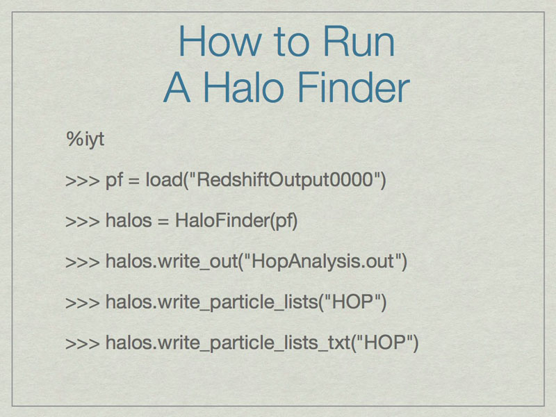

The first command builds a reference to an Enzo dataset. The second
runs HOP on the particles in the dataset and stores the result in the
``halos`` object. The ``write_out`` command writes the halo particulars to a
text file that contains the ID, mass, center of mass, maximum radius, bulk
velocity and velocity dispersion for each halo.
``write_particle_lists`` and ``write_particle_lists_txt`` stores the information
for the exact particles that are identified in each halo.

.. image:: _images/skory-016-001.jpg
   :width: 800
   :height: 600

This shows how to find halos very simply and quickly using HOP in yt. First call ‘iyt’ from the 
command line. Next we reference the dataset, and then find the halos using HOP and the 
default settings. The next command writes out a text file with halo particulars, next the 
particle data for halos is written to a HDF5 file, and the last command saves a text file of 
where the particle halo data goes (important for parallel analysis).

.. image:: _images/skory-017-001.jpg
   :width: 800
   :height: 600

test1_Projection_x_Density.png. A density projection through a test dataset.

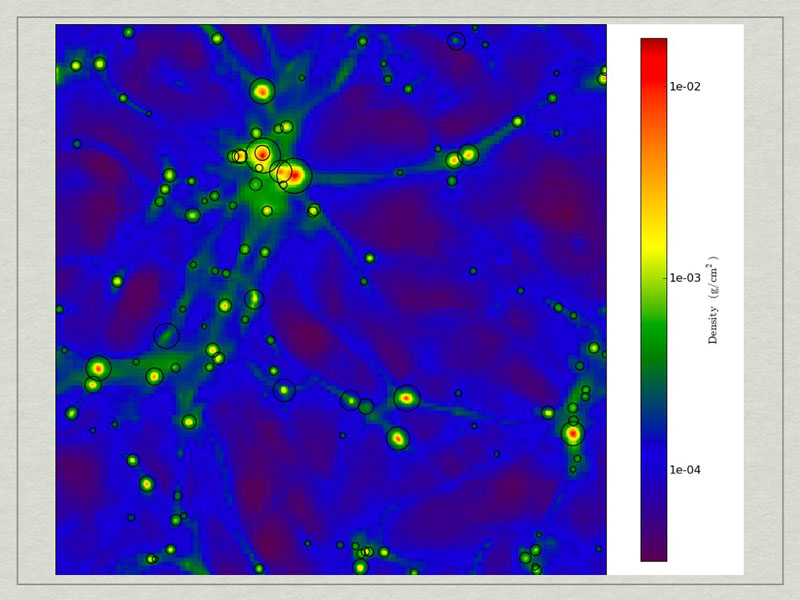

test2_Projection_x_Density.png. The halos have beecorresponds to the maximum
radius of the halo.

.. image:: _images/skory-019-001.jpg
   :width: 800
   :height: 600

It is easy to access information about halos. All of these are in code units.

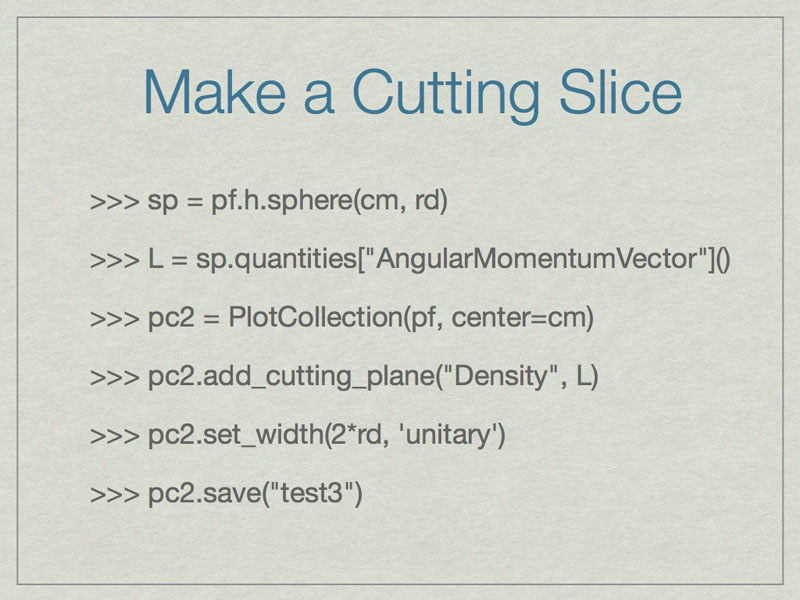

These commands will make a cutting slice through the center of the halo
with normal vector oriented along the angular momentum vector of the halo.

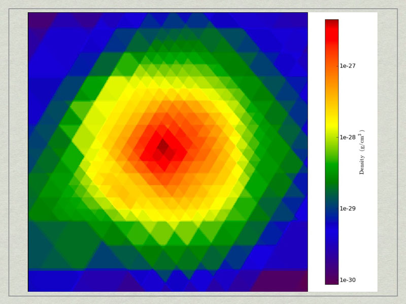

test3_CuttingPlane__Density.pngtest3_CuttingPlane__Density.png.

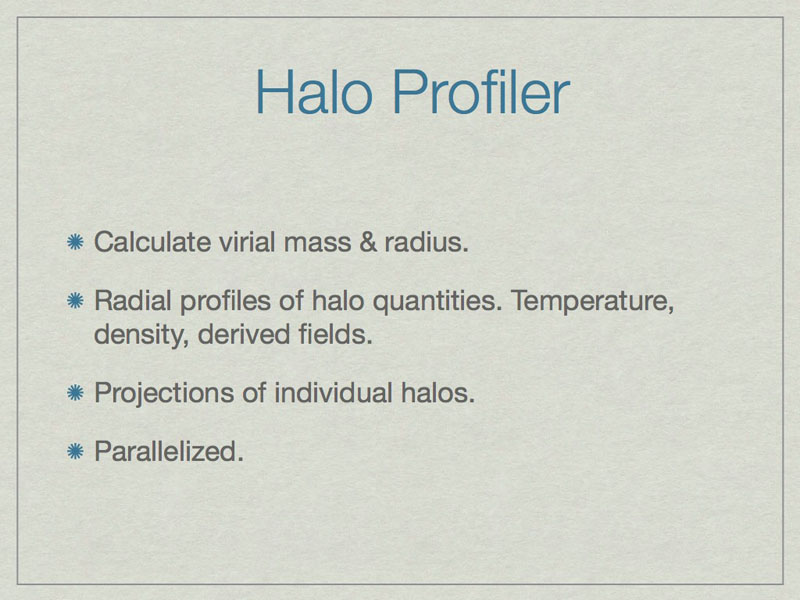

he halo profiler written by Britton Smith can analyze halos for various quantities. Given a 
HopAnalysis.out file, it can calculate many things on each halo.

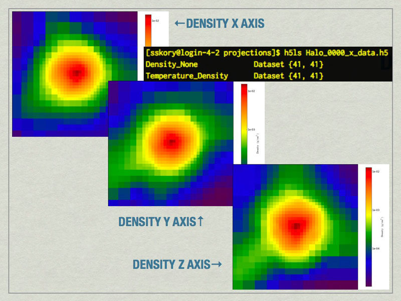

mages of the largest halo in the volume produced by the Halo Profiler. Also shown is the 
contents of the HDF5 files produced by the Halo Profiler.

.. image:: _images/skory-024-001.jpg
   :width: 800
   :height: 600

Merger trees are important when studying a halo because they affect many aspects of the 
halo. A merger tree tool analyzes a time-ordered series of datasets to build a comprehensive 
listing of the relationships between halos.

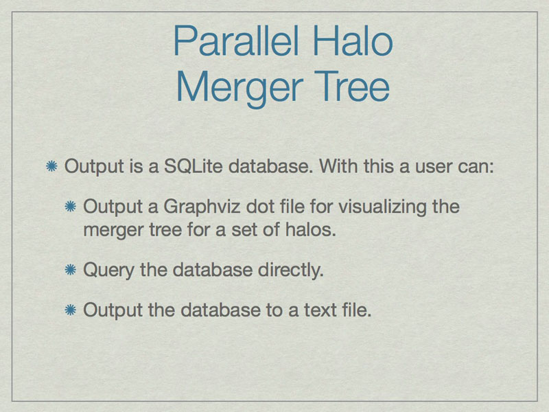

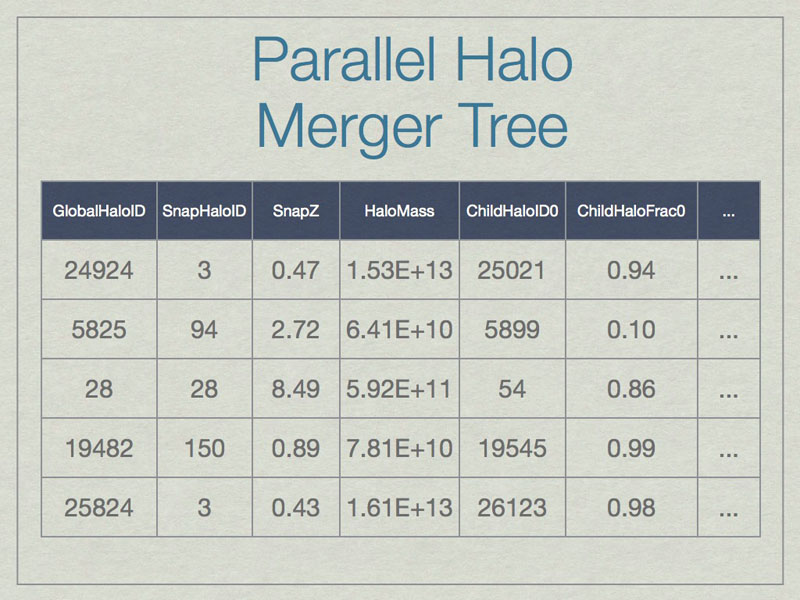

A SQL database can be thought of as a spreadsheet-like container, however entries are not 
ordered, unless the SQL query specifies that. This shows a few made-up example values in 
the database for a few real columns. Note that SnapHaloID is not unique. There are more 
columns in the database, but this is just an example. Columns not shown list the children for 
these halos.

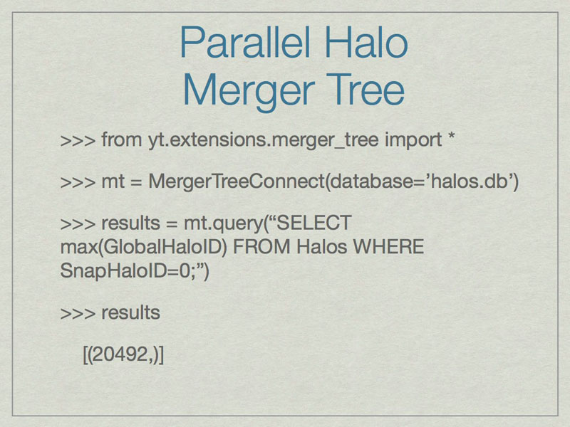

An example of how to find the GlobalHaloID for the most massive halo for the lowest redshift 
dataset.

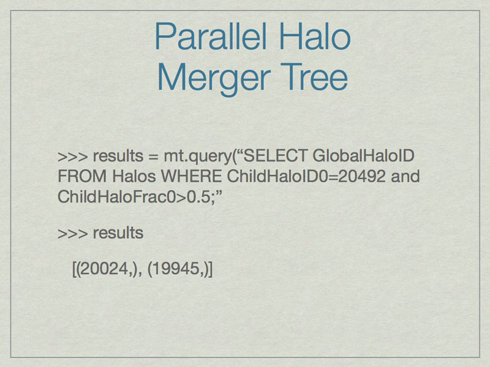

Using the output of the previous slide, an example of how to find the parents that
contribute the greatest fraction of their mass to 
the most massive halo at the lowest redshift.

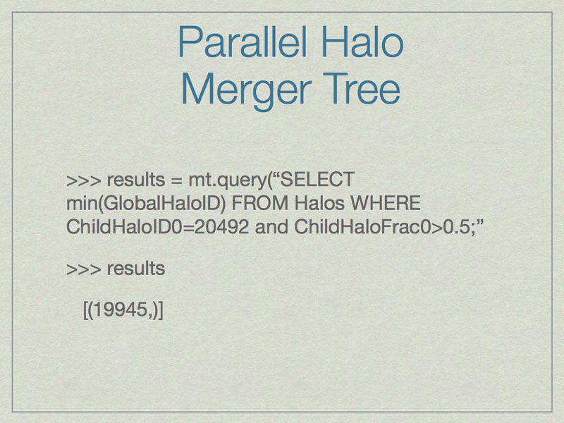

An example of how to find the most massive parent of the most massive halo at the lowest 
redshift.

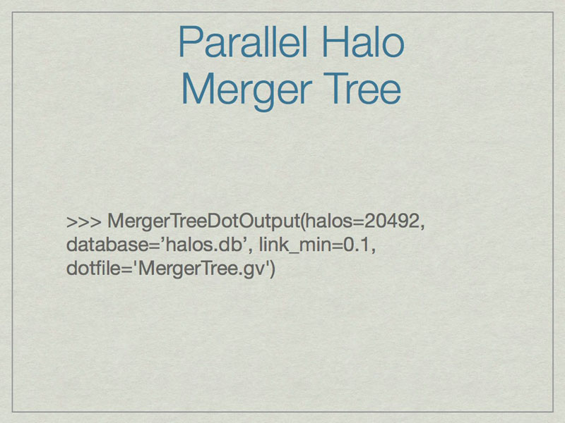

An example of how to output the full merger tree for a given halo (20492) to a graphviz file 
(MergerTree.gv).

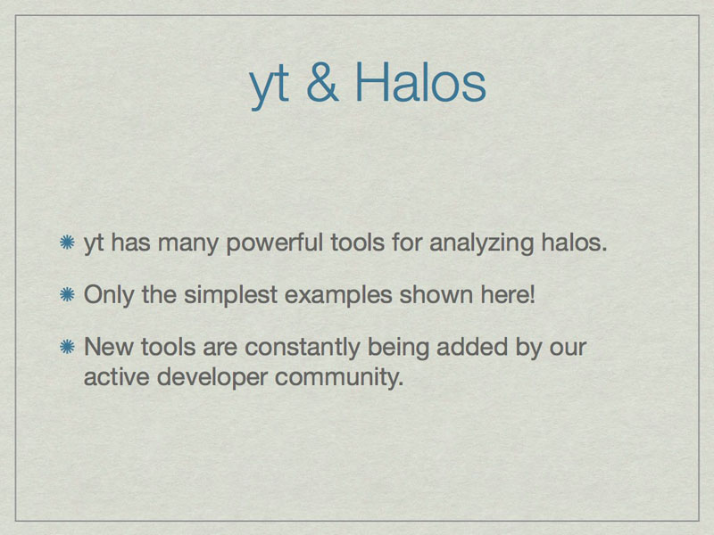

Merger Tree Graphviz Example
----------------------------

Below is an example section of the Graphviz view of the MergerTree.gv file
produced above.

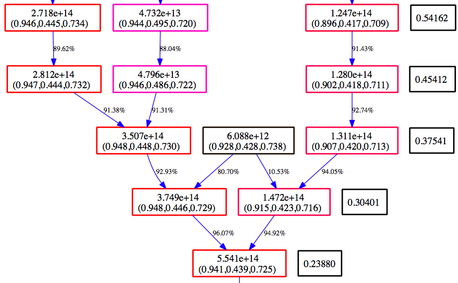

Time moves from the top to the bottom.
The numbers in the black boxes give the redshift for each horizontal level
of the merger tree.
Each colored box corresponds to a halo that is in the merger tree for our final halo.
The top number in each box gives the mass of the halo as determined by the halo
finder.
The second number is the center of mass for the halo in code units.
The color of the box is scaled such that at each redshift, the most massive halo
is red, and the smallest blue.
The arrows connect a 'parent' halo to a 'child' halo, and the number next to
each arrow gives the percentage of the mass of the parent halo that goes to
the child halo.

