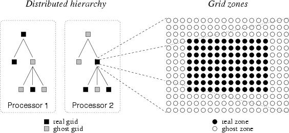

.. _EnzoAlgorithms:

Enzo Algorithms
===============

This section provides a very short overview of the algorithms used by
the Enzo code. References to texts and journal articles providing a
more complete discussion of the algorithms are included at the end of
this page for the interested reader, or you can go to
:ref:`EnzoPrimaryReferences`.  for a more current list. As of this
writing (October 2008), a formal Enzo method paper has not been
published, but is in preparation. Much of the text and images on this
page have been taken from one of the |LCA|_ contributions to the
|AMR2003|_ [1]_ Enzo is written in a mixture of C++ and
Fortran 77. High-level functions and data structures are implemented
in C++ and computationally intensive lower-level functions are written
in Fortran.  Enzo is parallelized using the `MPI`_ message-passing
library and uses the `HDF5`_ data format to write out data and restart
files in a platform-independent format.

.. |LCA| replace:: Laboratory for Computational Astrophysics
.. _LCA: http://lca.ucsd.edu

.. |AMR2003| replace:: 2003 University of Chicago AMR conference
.. _AMR2003: http://flash.uchicago.edu/amr2003

.. _MPI: http://www.mcs.anl.gov/research/projects/mpi/
.. _HDF5: http://www.hdfgroup.org/HDF5/

Adaptive Mesh Refinement
------------------------

Enzo allows hydrodynamics in 1, 2 and 3 dimensions using the structured
adaptive mesh refinement (SAMR) technique developed by Berger and Collela
[2]_. The code allows arbitrary integer ratios of parent and child grid
resolution and mesh refinement based on a variety of criteria, including baryon
and dark matter overdensity or slope, the existence of shocks, Jeans length,
and cell cooling time. The code can also have fixed static nested subgrids,
allowing higher initial resolution in a subvolume of the simulation. Refinement
can occur anywhere within the simulation volume or in a user-specified
subvolume.

The AMR grid patches are the primary data structure in Enzo. Each individual
patch is treated as an individual object, and can contain both field variables
and particle data. Individual patches are organized into a dynamic distributed
AMR mesh hierarchy using arrays of linked lists to pointers to grid objects.
The code uses a simple dynamic load-balancing scheme to distribute the workload
within each level of the AMR hierarchy evenly across all processors.

Although each processor stores the entire distributed AMR hierarchy, not all
processors contain all grid data. A grid is a *real grid* on a particular
processor if its data is allocated to that processor, and a *ghost grid* if its
data is allocated on a different processor.  Each grid is a real grid on
exactly one processor, and a ghost grid on all others.  When communication is
necessary, MPI is used to transfer the mesh or particle data between
processors. The tree structure of a small illustrative 2D AMR hierachy - six
total grids in a three level hierarchy distributed across two processors - is
shown on the left in Figure 1.

   **Figure 1.** Real and ghost grids in a hierarchy; real and ghost zones
   in a grid.

Each data field on a real grid is an array of zones with dimensionality equal
to that of the simulation (typically 3D in cosmological structure formation).
Zones are partitioned into a core block of *real zones* and a surrounding layer
of *ghost zones*. Real zones are used to store the data field values, and ghost
zones are used to temporarily store values from surrounding areas, ie,
neighboring grids, parent grids or external boundary conditions, when required
for updating real zones.  The ghost zone layer is three zones deep in order to
accomodate the computational stencil in the hydrodynamics solver (See below),
as indicated in the right panel in Figure 1. These ghost zones can lead to
significant computational and storage overhead, especially for the smaller grid
patches that are typically found in the deeper levels of an AMR grid hierarchy.

For more information on Enzo implementation and data structures, see references
[3]_, [4]_, [5]_, and [6]_.

Dark Matter Dynamics
--------------------

The dynamics of large-scale structures are dominated by dark matter, which
accounts for approximately 85% of the matter in the universe but can only
influence baryons via gravitational interaction.  There are many other
astrophysical situations where gravitational physics is important as well, such
as galaxy collisions, where the stars in the two galaxies tend to interact in a
collisionless way.

Enzo uses the Particle-Mesh N-body method to calculate collisionless particle
dynamics. This method follows trajectories of a representative sample of
individual particles and is much more efficient than a direct solution of the
Boltzmann equation in most astrophysical situations.  The particle trajectories
are controlled by a simple set of coupled equations (for simplicity, we omit
cosmological terms):

.. math::

   \frac{d\mathbf{x}_p}{dt} = \mathbf{v}_p

and

.. math::

   \frac{d\mathbf{v}_p}{dt} = -\nabla \phi

Where x\ :sub:`p`\  and v\ :sub:`p`\  are the particle position and velocity
vectors, respectively, and the term on the right-hand side of the second
equation is the gravitational force term. The solution to this can be found by
solving the elliptic Poisson's equation:

.. math::

   \nabla^2 \phi = 4 \pi G \rho

where :math:`\rho` is the density of both the collisional fluid
(baryon gas) and the collisionless fluid (particles).

These equations are finite-differenced and for simplicity are solved with the
same timestep as the equations of hydrodynamics.  The dark matter particles are
sampled onto the grids using the triangular-shaped cloud (TSC) interpolation
technique to form a spatially discretized density field (analogous to the
baryon densities used to calculate the equations of hydrodynamics) and the
elliptical equation is solved using FFTs on the triply periodic root grid and
multigrid relaxation on the subgrids.  Once the forces have been computed on
the mesh, they are interpolated to the particle positions where they are used
to update their velocities.

Hydrodynamics
-------------

The primary hydrodynamic method used in Enzo is based on the piecewise
parabolic method (PPM) of Woodward & Colella [7]_ which has been
significantly modified for the study of cosmology.  The modifications
and several tests are described in much more detail in [8]_,
and we recommend that the interested reader look there.

PPM is a higher-order-accurate version of Godunov's method with
third-order-accurate piecewise parabolic monotolic interpolation and a
nonlinear Riemann solver for shock capturing. It does an excellent job
capturing strong shocks and outflows. Multidimensional schemes are built up by
directional splitting, and produce a method that is formally
second-order-accurate in space and time and explicitly conserves energy,
momentum and mass flux. The conservation laws for fluid mass, momentum and
energy density are written in comoving coordinates for a
Friedman-Robertson-Walker spacetime. Both the conservation laws and Riemann
solver are modified to include gravity, which is calculated as discussed above.

There are many situations in astrophysics, such as the bulk hypersonic motion
of gas, where the kinetic energy of a fluid can dominate its internal energy by
many orders of magnitude. In these situations, limitations on machine precision
can cause significant inaccuracy in the calculation of pressures and
temperatures in the baryon gas. In order to address this issues, Enzo solves
both the internal gas energy equation and the total energy equation everywhere
on each grid, at all times. This *dual energy formalism* ensures that the
method yields the correct entropy jump at strong shocks and also yields
accurate pressures and temperatures in cosmological hypersonic flows. See
reference [8]_ for more information about the dual energy formalism.

As a check on our primary hydrodynamic method, we also include an
implementation of the hydro algorithm used in the Zeus astrophysical
code [9]_, [10]_. This staggered grid, finite difference method
uses artificial viscosity as a shock-capturing technique and is
formally first-order-accurate when using variable timesteps (as is
common in structure formation simulations), and is not the preferred
method in the Enzo code.

Cooling/Heating
-------------------------------------------

The cooling and heating of gas is extremely important in astrophysical
situations. To this extent, two radiative cooling models and several uniform
ultraviolet background models have been implemented in an easily extensible
framework.

The simpler of the two radiative cooling models assumes that all species in the
baryonic gas are in equilibrium and calculates cooling rates directly from a
cooling curve assuming Z = 0.3 Z\ :sub:`o`\ .  The second routine, developed by
Abel, Zhang, Anninos & Norman [11]_, assumes that the gas has primordial
abundances (ie, a gas which is composed of hydrogen and helium, and unpolluted
by metals), and solves a reaction network of 28 equations which includes
collisional and radiative processes for 9 seperate species (H, H\ :sup:`+`\ ,
He, He\ :sup:`+`\ , He\ :sup:`++`\ , H\ :sup:`-`\ , H\ :sub:`2`\ \ :sup:`+`\ ,
H\ :sub:`2`\  and e\ :sup:`-`\ ). In order to increase the speed of the
calculation, this method takes the reactions with the shortest time scales
(those involving H\ :sup:`-`\  and H\ :sub:`2`\ \ :sup:`+`\ ) and decouples
them from the rest of the reaction network and imposes equilibrium
concentrations, which is highly accurate for cosmological processes. See
[11]_ and [12]_ for more information.

The vast majority of the volume of the present-day universe is occupied by
low-density gas which has been ionized by ultraviolet radiation from quasars,
stars and other sources. This low density gas, collectively referred to as the
Lyman-&alpha; Forest because it is primarily observed as a dense collection of
absorption lines in spectra from distant quasars (highly luminous extragalactic
objects), is useful because it can be used to determine several cosmological
parameters and also as a tool for studying the formation and evolution of
structure in the universe (see [13]_ for more information). The spectrum of
the ultraviolet radiation background plays an important part in determining the
ionization properties of the Lyman-&alpha; forest, so it is very important to
model this correctly. To this end, we have implemented several models for
uniform ultraviolet background radiation based upon the models of Haardt &
Madau [14]_.

Star Formation and Feedback
---------------------------

One of the most important processes when studying the formation and evolution
of galaxies (and to a lesser extent, groups and clusters of galaxies and the
gas surrounding them) is the formation and feedback of stars. We use a
heuristic prescription similar to that of Cen & Ostriker [15]_ to convert
gas which is rapidly cooling and increasing in density into star *particles*
which represent an ensemble of stars. These particles then evolve
collisionlessly while returning metals and thermal energy back into the gas in
which they formed via hot, metal-enriched winds.

Parallelization in Enzo
-----------------------

Enzo uses a grid-based parallelization scheme for load balancing.  The root
grid is partitioned up into N pieces (where N is the number of processors), and
each processor is given a piece of the root grid, which it keeps for the
duration of the simulation run.  Subgrids are treated as independent objects
and are distributed to the processors such that each level of grids is
load-balanced across all processors.  Boundary fluxes between neighboring grid
patches and parent and children grids are passed back and forth using MPI
commands.

The one portion of the code that is parallelized differently is the root grid
gravity solver. As discussed above, the gravitational potential on the root
grid is solved using a fourier transform method, which requires its own
message-passing routines.  The three-dimensional total density field (composed
of the dark matter plus baryon density on the root grid) is decomposed into
two-dimensional slabs (requiring one set of messages), which are then fourier
transformed.  The slabs are then transposed along another axis (requiring a
second set of messages to be passed) and transformed again, and a third set of
messages is required in order to obtain the original block decomposition. This
is unavoidable when using a fourier transform scheme, and as a result the speed
of the root grid gravity solver is very sensitive to the speed of the
communication network on the platform that Enzo is being run on.

Initial Conditions Generator
----------------------------

A somewhat detailed description of the method Enzo uses to create
initial conditions can be downloaded as a :download:`postscript
<makeics.ps>` or :download:`PDF <makeics.pdf>` document.  To
summarize: Dark matter particles and baryon densities are laid out on
a uniform Cartesian grid. Given a user-specified power spectrum P(k),
the linear density fluctuation field is calculated at some initial
time (typically z = 100 for high-resolution/small box simulations) by
using P(k) to obtain the density fluctuations in k-space on a uniform
Cartesian grid.  P(k) is sampled discretely at each grid point, with
the density fluctuations having a random complex phase and
amplitude. The amplitude is generated such that the distribution of
amplitudes is Gaussian.  This cube is then fourier transformed to give
physical density fluctuations. Particle positions and velocities and
baryon velocities are calculated using the Zel'dovich approximate. See
the document above, or read Bertschinger 1998 [16]_ for more
information.

References
----------

.. note:: Some of the links to references require a subscription.

.. [1] B. W. O'Shea et al. "Introducing Enzo, an AMR Cosmology
   Application." To be published in Adaptive Mesh Refinement - Theory
   And Applications, the proceedings from the 2003 University of
   Chicago AMR Workshop

.. [2] M. J. Berger and P. Colella. "Local adaptive mesh refinement
   for shock hydrodynamics," *J. Comp. Phys*, 82:64-84, 1989 `link
   <https://seesar.lbl.gov/ANAG/publications/colella/A_1_13.pdf>`__

.. [3] G. L. Bryan. "Fluids in the universe: Adaptive mesh in
   Cosmology."  *Computing in Science and Engineering*, 1:2 p.46, 1999
   `link
   <http://www2.computer.org/portal/web/csdl/doi/10.1109/5992.753046>`__

.. [4] G. L. Bryan and M. L. Norman. "A hybrid AMR application for
   cosmology and astrophysics."  In *Workshop on Structured Adaptive
   Mesh Refinement Grid Methods*, p. 165.  IMA Volumes in Mathematics
   #117, 2000 `link
   <http://www.ima.umn.edu/springer/description.html#v117>`__

.. [5] G. L. Bryan and M. L. Norman. In D.A. Clarke and M. Fall,
   editors, Computational Astrophyiscs: 12th Kingston Meeting on
   Theoretical Astrophysics, proceedings of a meeting held in Halifax;
   Nova Scotia; Canada Oct.  17-19, 1996.  ASP Conference Series #123,
   1997 `link
   <http://www.aspbooks.org/a/volumes/table_of_contents/?book_id=235>`__

.. [6] M. L. Norman and G. L. Bryan. "Cosmological Adaptive Mesh
   Refinement."  In Kohji Tomisaka, Shoken M. Miyama and Tomoyuki
   Hanawa, editors, Numerical Astrophysics: Proceedings of the
   International Conference on Numerical Astrophysics 1998,
   p. 19. Kluwer Academics, 1999

.. [7] P. R. Woodward and P. Colella. "A piecewise parabolic method
   for gas dynamical simulations," *J. Comp. Phys*, 54:174, 1984 `link
   <https://seesar.lbl.gov/anag/publications/colella/A_1_4_1984.pdf>`__

.. [8] G. L. Bryan, M. L. Norman, J. M. Stone, R. Cen and J. P.
   Ostriker. "A piecewise parabolic method for cosmological
   hydrodynamics," *Comp. Phys. Comm.*, 89:149, 1995 `link
   <http://adsabs.harvard.edu/abs/1995CoPhC..89..149B>`__

.. [9] J. M. Stone and M. L. Norman. "Zeus-2D: A radiation
   magnetohydrodynamics code for astrophysical flows in two space
   dimensions. I. The hydrodynamics algorithms and tests."  *The
   Astrophysical Journal Supplement*, 80:753, 1992 `link
   <http://adsabs.harvard.edu/abs/1992ApJS...80..753S>`__

.. [10] J. M. Stone and M. L. Norman. "Zeus-2D: A radiation
   magnetohydrodynamics code for astrophysical flows in two space
   dimensions. II. The magnetohydrodynamic algorithms and tests."
   *The Astrophysical Journal Supplement*, 80:791, 1992
   `link <http://adsabs.harvard.edu/abs/1992ApJS...80..791S>`__

.. [11] T. Abel, P. Anninos, Y. Zhang and M.L. Norman. "Modeling
   primordial gas in numerical cosmology." New Astronomy, 2:181-207,
   August 1997
   `link <http://adsabs.harvard.edu/abs/1997NewA....2..181A>`__

.. [12] P. Anninos, Y. Zhang, T. Abel and
   M.L. Norman. "Cosmological hydrodynamics with multispecies
   chemistry and nonequilibrium ionization and cooling." New
   Astronomy, 2:209-224, August 1997
   `link <http://adsabs.harvard.edu/abs/1997NewA....2..209A>`__

.. [13] M. Rauch. "The Lyman Alpha Forest in the Spectra of QSOs."
   Annual Review of Astronomy and Astrophysics, 36:267-316, 1998
   `link <http://adsabs.harvard.edu/abs/1998ARA%26A..36..267R>`__

.. [14] F. Haardt and P. Madau. "Radiative Transfer in a Clumpy
   Universe, II. The Ultraviolet Extragalactic Background." The
   Astrophysical Journal, 461:20, 1996
   `link <http://adsabs.harvard.edu/abs/1996ApJ...461...20H>`__

.. [15] R. Cen and J.P. Ostriker. "Galaxy formation and physical
   bias." The Astrophysical Journal Letters, 399:L113, 1992
   `link <http://adsabs.harvard.edu/abs/1992ApJ...399L.113C>`__

.. [16] E. Bertschinger. "Computer Simulations in
   Cosmology." Annual Review of Astronomy and Astrophysics, 36:599
   `link <http://adsabs.harvard.edu/abs/1998ARA%26A..36..599B>`__

