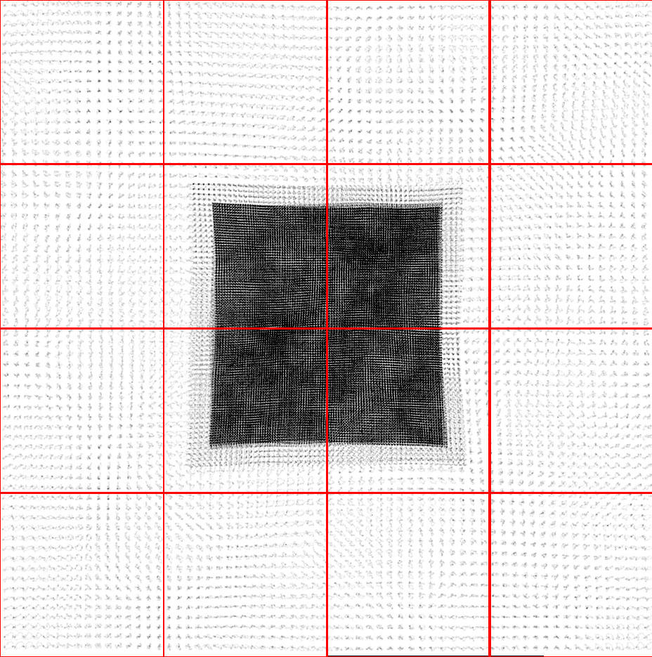

Nested Grid Particle Storage in RebuildHierarchy
================================================

Problem
-------

In the previous version of ``RebuildHierarchy()``, all of the particles were
moved to the parent on the level L\ :sub:`0`\  being rebuilt. This causes
problems when running large simulations with nested initial grids because a
small number of top-level grids cover the refine region, compared to the total
number of top-level grids. This is illustrated in the figure below.

On distributed memory machines, only one (or more) top-level grid exists on one
processor. The particles are stored only on the host processor, stored in
``grid::ProcessorNumber``. This processor will run out of memory if a large
number of particles are moved exclusively to a grid on this processor.

Solution
--------

We can avoid this memory oversubscription by temporarily keeping the particles
on the processor from the previous timestep, i.e. the processor of the original
child grid, during the rebuild process.  However, we still want to move the
particles to the parent grid on level L\ :sub:`0`\  because we will be
rebuilding this and finer levels from the data existing on these grids.

This is only necessary on levels with static subgrids because on levels with
dynamics hierarchies the grids will be distributed across processors
sufficiently to avoid this problem. On the levels with static subgrids, we
depart from the standard particle storage in Enzo, where the particles are
stored on one processor and ``NumberOfParticles`` is the same on all
processors. We adopt the strategy of storing particles on many processors for
one grid, and ``NumberOfParticles`` denotes the number of particles actually
stored on the local processor. Once we rebuild the coarsest level with a
dynamical hierarchy, we move all of the particles to their host processor, i.e.
``ProcessorNumber``, and synchronize ``NumberOfParticles`` to equal the total
number of particles on the grid over all processors.

Below we will outline this method to distribute memory usage from particles
during ``RebuildHierarchy()`` on level L. Pre-existing routines in
``RebuildHierarchy()`` are not included in the outline.

#. Set ``NumberOfParticles`` to zero on all grids on level >= L, except
   on the grid's host processor.

#. Find the finest level (L\ :sub:`sub`\ ) with static subgrids. In
   the code, this is called ``MaximumStaticSubgridLevel``.

#. ``grid::MoveAllParticles()`` -- Move all particles on grids on level >
   L to their parents on level L, but keep them on the same processor as
   before. Now the particles are on their parent, but distributed
   across many processors.

#. ``CommunicationTransferParticles()`` -- Move any particles that have
   migrated across grid boundaries to their siblings.

#. ``CommunicationCollectParticles(SIBLINGS_ONLY)`` -- If we are
   rebuilding a level > L\ :sub:`sub`\ , move all particles to their host
   processor, as this new method is not needed. This was previously done
   in ``grid::MoveAllParticles``. This routine is faster than before
   because we do the communication in one ``MPI_Alltoallv()`` call.

#. Loop over levels L\ :sub:`0`\  -> ``MAX_DEPTH_OF_HIERARCHY``.

#. ``DepositParticleMassFlaggingField()`` -- If level <= L\ :sub:`sub`\ ,
   then the particles are distributed across processor. This causes
   complications when creating the mass refinement flagging field for
   particles. Therefore, we must sum this particle mass field over
   these processors. For each grid, only processors with particles
   contribute to this sum to reduce the amount of computation and
   communication. In short, this routine performs a non-blocking
   ``MPI_SUM`` over a select number of processors.
#. ``CommunicationCollectParticles(SUBGRIDS_LOCAL)`` -- This routine
   replaces ``grid::MoveSubgridParticlesFast()``. It keeps the particles on
   the same processor, but this doesn't matter here because the
   children grids are always created on the same processor as its
   parent and then moved to another processor during load balancing.
#. ``CommunicationCollectParticles(SIBLINGS_ONLY)`` -- After load
   balancing is complete on level L\ :sub:`sub`\, we can safely move the
   particles to their host processor without the worry of running out
   of memory.

