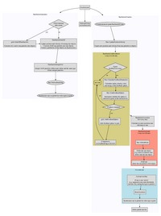

.. _star_particle_class:

Star Particle Class
===================

Purpose
-------

To give star particles more functionality and interaction with the
grids, it was useful to create a new class for a generic particle
type
that can represent, e.g., stars, black holes, sink particles.

Main features
-------------

-  merging
-  accretion
-  conversion to a radiation source
-  adding feedback spheres to the grid, e.g. mass removal from
   accretion, supernovae.
-  different behaviors for different star types
-  multiple types of star particles
-  "active" and "inactive" stars

Approach
--------

   
   A flowchart of the logic of the star particle class.
   :download:`View PDF <StarParticleClassFlowchart.pdf>`.

We keep the original implementation of the particles that are stored
in the pointers, ``ParticlePosition``, ``ParticleVelocity``,
``ParticleMass``, ``ParticleNumber``, ``ParticleType``, and
``ParticleAttribute``. Star particles are still created in the FORTRAN
routines, e.g. ``star_maker2.F``. In the current version, the star
class is a layer on top of these particles.  Thus we must keep the
particle pointers and objects synchronized when their quantities
change.

Particles created in the FORTRAN routines that will be converted into
a star object initially have a negative particle type. This indicates
that the star is not "born" yet, which is also used to flag various
feedback spheres, such as mass removal from the grid. The stars are
activated, i.e. positive particle type, in ``Star::ActivateNewStar()``
after it has been checked for mergers, accretion, and feedback.

We store the star objects as a linked list in grid class. Because a
star object can affect multiple grids (over multiple processors) when
adding feedback sphere, processors other than the one hosting the star
particle needs to know about this star object. Currently for
convenience, we create a global list of star objects on all
processors. For not many stars (< 100k), this does not consume that
much memory. However in the future, we might have to reconsider how
star particles are communicated across processors.

Feedback spheres
~~~~~~~~~~~~~~~~

Any event can be set in ``Star::SetFeedbackFlag`` to add a feedback
sphere. This sphere can be of any size, and its properties are set in
``Star::CalculateFeedbackParameters()`` and
``grid::AddFeedbackSphere()``.  Because they can cover grids on
multiple levels, we have to ensure that they are all at the same
time. In ``Star::FindFeedbackSphere()``, we check if sphere is
completely contained within grids on the current level. If true, we
can safely add the sphere. If it's not imperative that the grids are
completely synchronized, one can add the feedback sphere immediate
after the star object is flagged for feedback.

Accretion / Mass Loss
~~~~~~~~~~~~~~~~~~~~~

Star objects can store up to 100 (``#define MAX_ACCR``) accretion
rates as a function of time. Alternatively, currently in the black
hole particles, they can have an instantaneous accretion rate. This is
done in ``Star::CalculateMassAccretion``.  The actual accretion to the
star object is done in ``Star::Accrete()``.

How to add a new particle type
------------------------------

#. Set the particle type to the negative of the particle type in the
   star maker routine. Be sure not to overwrite the type like what's
   done in the regular ``star_maker.F`` routines.

#. Add the particle type to the if-statement in
   ``grid::FindNewStarParticles``.

#. Then the particles merge if any exist within
   ``StarClusterCombineRadius``. This is not restricted to only star
   cluster (radiating) particles. Even if there is any merging, the
   particle shouldn't disappear.

#. At the end of ``StarParticleInitialize()``, the routine checks if
   any stars should be activated in ``Star_SetFeedbackFlag``.  This
   is where you should check first for errors or omissions. You'll
   have to add a new case to the switch statement. Something as simple
   as

   .. code-block:: c

      case NEW_PARTICLE_TYPE:
      if (this->type < 0)
         this->FeedbackFlag = FORMATION;
      else
         this->FeedbackFlag = NO_FEEDBACK;

   will work.

   After this, the particle is still negative but will be flipped
   after the feedback to the grid is applied in
   ``Star_ActivateNewStar()`` that's called from
   ``StarParticleFinalize``. Here for Pop II and III stars, we use a
   mass criterion. For Pop III stars, we set the mass to zero in the
   ``pop3_maker()`` f77 routine, then only set the mass after we've
   applied the feedback sphere.

#. The grid feedback is added in ``StarParticleAddFeedback`` that is
   called in ``StarParticleFinalize()``. In
   ``Star_CalculateFeedbackParameters()``, you'll want to add an
   extra case to the switch statement that specifies the radius of the
   feedback sphere and its color (metal) density.

#. If the feedback sphere is covered by grids on the level calling
   ``StarParticleAddFeedback()`` (i.e.  all of the cells will be at
   the same time), then ``Grid_AddFeedbackSphere()`` will be
   called. Here you'll have to add another if-block to add your color
   field to the grid.

